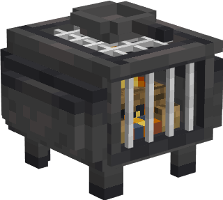
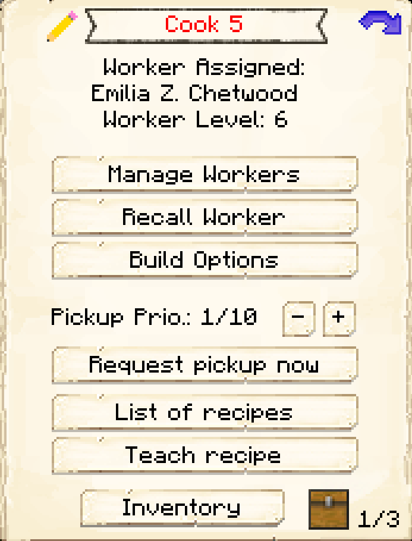
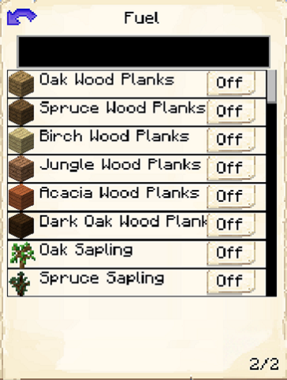

# Restaurant

    
    

    

        

        
<strong>Worker:</strong>

        

        

        
<a href="../workers/cook">Cook</a> <a href="../workers/assistantcook">Assistant Cook</a>

        

    

    

    <recipe>restaurant</recipe>

The Restaurant is where the Cook will cook food, provided they have the necessary ingredients and fuel. When citizens are hungry, they will come to the Restaurant and the Cook will give them food. The Assistant Cook also works at the Restaurant. They craft needed food to help supply the colony.

**Note:** You can only hire an Assistant Cook when the Restaurant is level 3 or higher.

## Restaurant GUI

When accessing the Restaurant's hut block by right-clicking on it, you will see a GUI with different options:

 

  

    
  

  

     
    <ul>
      
        <li><strong>{{ item.button }}:</strong> {{ item.content }}</li>
      
    </ul>
  

   

This is page two of the Restaurant GUI.

  

    
  

  

      <ul>
      <li><strong> Fuel: </strong> Listed here are items that can be used by the Cook as fuel in their furnaces. Simply turn on any that you want your Cook to use, and a <a href="../../source/workers/courier"> Courier</a> will deliver those items to the Cook when they need fuel. (The black box at the top is to search for items.)</li>
      </ul>
    
  
    

This is page three of the Restaurant GUI.

  

    
  

  

      <ul>
      <li><strong> Minimum Stock: </strong> Use this button to tell the Restaurant to request a minimum stock to keep on hand. The Cook will still give out items that are set as the minimum stock, but will request more if they no longer have enough. Set items will be displayed above the button.</li>
      </ul>
    
  
   
