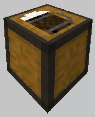
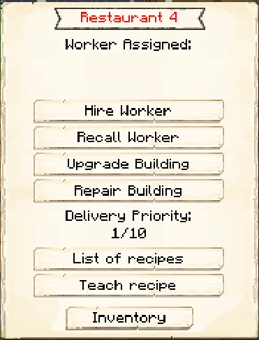
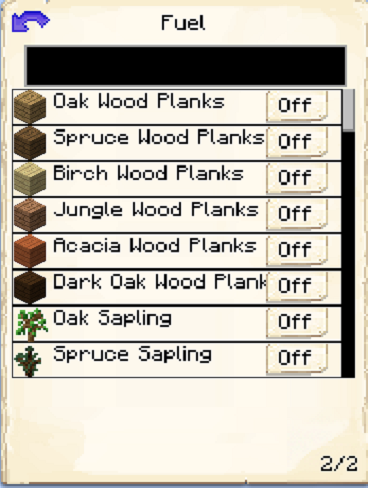

# Restaurant

    
    

    

        

        
<strong>Worker:</strong>

        

        

        
<a href="../workers/cook">Cook</a>

        

    

    

    <recipe>restaurant</recipe>

Welcome to the Restaurant’s Information Site.

Before you choose a place to build the Restaurant, take into account the location from the farmer(s), Warehouse and/or Herder(s). After you have selected a place for the Restaurant you have to craft the Restaurant Hut block and place it with the [Building Tool](../items/buildingtool). Once the Restaurant hut block is placed, the Cook will be automatically assigned (or you can manually assign one with the best [Traits](../systems/workerinfo) for a Cook if you changed this in the setting tab in the [Town Hall's GUI](../../source/buildings/townhall).

Now you will have to issue the builder the “Build” assignment so he can build the “Restaurant’s Hut”. Once the builder is done the Cook will start making steak, pork chops, baked potatoes, cooked fish and more right away.

**Hint:** Once the build is done, you should think about upgrading the Restaurant so that the worker can make more steak, pork chops, baked potatoes, cooked fish, etc at a faster pace.

  

## Hut GUI

When accessing the Restaurant's Hut block (right clicking on it) you will see a GUI with different options:

 

  

    
  

  

    
The Worker assigned and it's Level. (The worker levels up in time by working. The higher the level the faster and more efficient it will be). And the buttons:

    <ul>
      
        <li><strong>{{ item.button }}:</strong> {{ item.content }}</li>
      
    </ul>
  

  

    
  

  

      <ul><strong> Fuel: </strong> Listed are items that can be used by the cook as fuel in the furnaces. Simply turn on any that you want your cook to use, and the deliveryman will deliver those items to the cook when they need fuel.
      </ul>
    
  
  
   
  
### **To see build options please see the [Builder](../../source/workers/builder) Page**  

