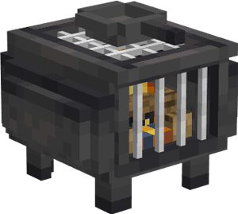

# Restaurant

    
    

    

        

        
<strong>Worker:</strong> <a href="../workers/cook">Cook</a>

        

    

    

    

        

        
<strong>Recipe:</strong> 
        

    

    <recipe>restaurant</recipe>
    

# About the Building

Once the building is built, Cook will start making steak, pork chops, baked potatoes, cooked fish and more right away.

**Hint:** Once the build is done, you should think about upgrading the Restaurant so that the worker can make more steak, pork chops, baked potatoes, cooked fish, etc at a faster pace.

# Restaurant Hut GUI

When accessing the Restaurant's Hut block (right clicking on it) you will see a GUI with different options:

 

  

    
  

  

    
The Worker assigned and it's Level. (The worker levels up in time by working. The higher the level the faster and more efficient it will be). And the buttons:

    <ul>
      
        <li><strong>{{ item.button }}:</strong> {{ item.content }}</li>
      
    </ul>
  

Page 2 is where you can tell the cook what items to use as fuel.

  

    
  
