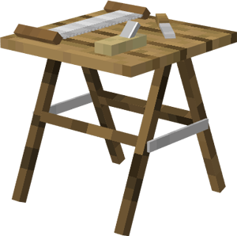

# Sawmill

    
    

    

        

        
<strong>Worker:</strong>

        

        

        
<a href="../workers/miller">Miller</a>

        

    

    

    <recipe>sawmill</recipe>

# About the Sawmill

The Sawmill is where the Miller will craft any items made of at least 75% wood (no bows or redstone items). For them to do this, you must teach the Sawmill the recipes and the Miller must receive a request for an item from another worker.

**Hint:** The number of recipes you can teach the Sawmill doubles per building level. So:

| Sawmill Level | Number of Recipes |
| :-----: | :-----: |
| 1 | 20 | 
| 2 | 40 |
| 3 | 80 |
| 4 | 160 | 
| 5 | 320 | 

# Sawmill GUI

When accessing the Sawmill's hut block by right-clicking on it, you will see a GUI with different options:  

  

    
  

  

     
    <ul>
      
        <li><strong>{{ item.button }}:</strong> {{ item.content }}</li>
      
    </ul>
  

  
   
  
