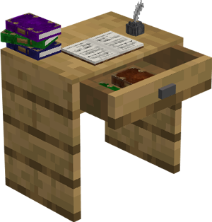

# School

    
    

    

        

        
<strong>Worker:</strong>

        

        

        
<a href="../workers/teacher">Teacher</a>

        

        

        
<a href="../workers/pupil">Pupil</a>

        

    

    

    <recipe>school</recipe>

## About the School

### Note: The School cannot be built until you finish the research in the [University](../../source/buildings/university).
 

The School is where the Teacher will level up the Pupils' (children) skills. Paper will increase the leveling speed of the Pupils. 

The level of the School determines how many Pupils can be taught at a time.

| Pupil Level | Pupils Taught |
| ----- | ----- |
| 1 | 2 |
| 2 | 4 |
| 3 | 6 |
| 4 | 8 |
| 5 | 10 |  

 

## School GUI

When accessing the School's hut block by right-clicking on it, you will see a GUI with different options:

  

    
  

  

     
    <ul>
      
        <li><strong>{{ item.button }}:</strong> {{ item.content }}</li>
      
    </ul>
  

   
