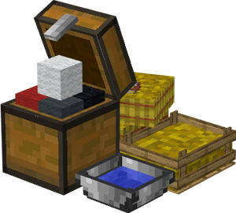

# Shepherd's Hut

    
    

    

        

        
<strong>Worker:</strong> <a href="../workers/shepherd">Shepherd</a>

        

    

    

    

        

        
<strong>Recipe:</strong> 
        

    

    <recipe>shepherd</recipe>

# About the Building

Once the building is built, you will have to capture and bring in 2 Sheep to the herder's hut. The herder will not catch and bring in any Sheep, only breed and butcher the ones in his hut area, so make sure you provide it with 2 initial Sheep.

**Note:** The Herder will only keep alive 2 Sheep per hut level, so at level 5 they will have 10 Sheep in their holding pens alive to breed and butcher. This means they will keep *MORE* and have faster production and collection of meats, drops and by products. So:

| Building Level | Sheep "Housed" |
| ----- | ----- |
| 1 | 2 |
| 2 | 4 |
| 3 | 6 |
| 4 | 8 |
| 5 | 10 |  

Now you can access the Sheep's Hut block (right click on it) and you will see a GUI with different options:  

# Shepherd Hut GUI

Now you can access the Sheep's Hut block (right click on it) and you will see a GUI with different options:

 

  

    
  

  

    
The Worker assigned and it's Level. (The worker levels up in time by doing it's work. The higher the level the faster and more efficient they will be). And the buttons:

    <ul> 
      
        <li><strong>{{ item.button }}:</strong> {{ item.content }}</li>
      
    </ul>
  

 

Page 2 is where you can tell the shepherd whether or not to dye the sheep. If this is turned on, the shepherd will randomly choose a color to dye the sheep.

  

    
  

