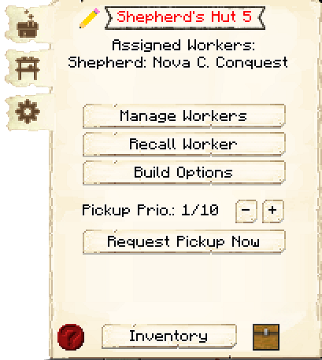

# Shepherd's Hut

    
    

    

        

        
<strong>Worker:</strong>

        

        

        
<a href="../workers/shepherd">Shepherd</a>

        

    

    

    <recipe>shepherd</recipe>

The Shepherd's Hut is where the Shepherd will breed and butcher sheep for food and wool. You will have to capture and bring in two sheep to the Shepherd's Hut, as the Shepherd will not catch and bring in any sheep.

**Note:** The Shepherd will only keep two sheep alive per hut level, so at level 5 they will have ten sheep in their holding pens to breed and butcher. This means they will be faster at producing and collecting meat and wool. So:

| Building Level | Sheep Housed |
| ----- | ----- |
| 1 | 2 |
| 2 | 4 |
| 3 | 6 |
| 4 | 8 |
| 5 | 10 |  

## Shepherd's Hut GUI

When accessing the Shepherd's Hut block by right-clicking on it, you will see a GUI with different options:

 

  

    
  

  

     
    <ul>
      
        <li><strong>{{ item.button }}:</strong> {{ item.content }}</li>
      
    </ul>
  

 

 

  

    
  

  

     
    
This is page two of the GUI. It has two buttons:

    <ul>
        <li><b>Breeding:</b> On by default. Here you can choose if the Shepherd will breed (and consequently kill) sheep or just shear them.</li>
      <li><b>Random Sheep Dying:</b> Off by default. Here you choose if the Shepherd will dye sheep random colors to get differently colored wool. (They do not require dye to do this.)</li>
    </ul>
  

  
  
   
