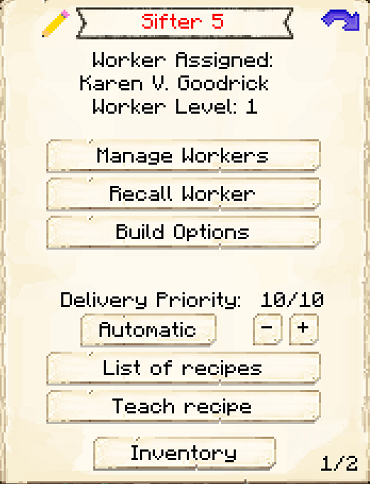
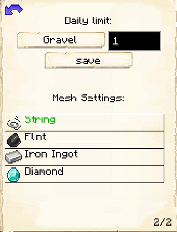

# Sifter

    
    

    

        

        
<strong>Worker:</strong> <a href="../workers/sifter">Sifter</a>

        

    

    

    

        

        
<strong>Recipe:</strong> 
        

    

    <recipe>sifter</recipe>
    

# About the Building

Once the builder is done you can now hire the Sifter and and select what item you want them to sift. Options for this are setup in the configuration file.

| Hut Level | Mesh Available | 
| ----- | ----- | 
| 1         | String         | 
| 2         | Flint          | 
| 3         | Iron           | 
| 4         | Diamond        | 

| Sifted Block| Chance for |
| ----- | ----- |
| Dirt |	beetroot seeds
| Dirt |	carrot
| Dirt |	melon seed
| Dirt |	potato
| Dirt |	pumpkin seeds
| Dirt |	sapling: Oak
| Dirt |	sapling: Spruce
| Dirt |	sapling: Birch
| Dirt |	sapling: Jungle
| Dirt |	sapling: Acacia
| Dirt |	sapling: Dark Oak
| Dirt |	wheat seeds
| Gravel |	coal
| Gravel |	diamond
| Gravel |	dye: Lapis Luzuli
| Gravel |	emerald
| Gravel |	flint
| Gravel |	gold ingot
| Gravel |	iron ingot
| Gravel |	iron nugget
| Gravel |	redstone
| Sand |	cactus
| Sand |	dye: Cocoa Bean
| Sand |	gold nugget
| Sand |	reeds
| Soul Sand |	blaze powder
| Soul Sand |	glowstone dust
| Soul Sand |	magma cream
| Soul Sand |	nether wart
| Soul Sand |	quartz
| Soul Sand |	skull: Human

# Sifter Hut GUI

When accessing the Sifter's Hut block (right clicking on it), you will see a GUI with different options:

 

  

    
  

  

    
The Worker assigned and it's Level. (The worker levels up in time by doing it's work. The higher the level the faster and more efficient it will be). And the buttons:

    <ul>
      
        <li><strong>{{ item.button }}:</strong> {{ item.content }}</li>
      
    </ul>
  

 

Page 2 of the GUI allows you to choose which block to sift, how many daily, and which mesh you want to use.

You must buy a mesh everytime you want to change it.

    
  
