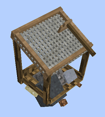
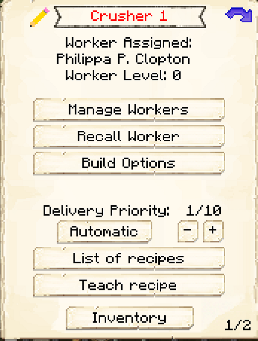

# Sifter

    
    

    

        

        
<strong>Worker:</strong>

        

        

        
<a href="../workers/sifter">Sifter</a>

        

    

    

    <recipe>sifter</recipe>

Welcome to the Sifter Information Site.

Before you choose a place to build the Sifter, take into account the location from Mine, Crusher, Warehouse and/or other Worker(s). After you have selected a place for the Hut, you have to craft the Sifter's Hut block and place it with your [Building Tool](../items/buildingtool). Once the hut block is placed, the Sifter will be automatically assigned (or you can manually assign one with the best  [Traits](../systems/workerinfo) for Sifter if you changed this in the settings tab in the [Town Hall's GUI](../../source/buildings/townhall).

Now you will have to issue the builder the “Build” assignment so it can build the “Sifter’s Hut”. Once the builder is done you can now hire the Sifter and and select what item you want them to sift. Options for this are setup in the configuration file.

| Hut Level | Mesh Available | Max Amount
| ----- | ----- | -----|
| 1         | String         | 16 |
| 2         | Flint          | 64 |
| 3         | Iron           | 144 |
| 4         | Diamond        | 256 |
| 5         | Any            | 999 |  

| Sifted Block| Chance for |
| ----- | ----- |
| Dirt |	beetroot seeds
| Dirt |	carrot
| Dirt |	melon seed
| Dirt |	potato
| Dirt |	pumpkin seeds
| Dirt |	sapling: Oak
| Dirt |	sapling: Spruce
| Dirt |	sapling: Birch
| Dirt |	sapling: Jungle
| Dirt |	sapling: Acacia
| Dirt |	sapling: Dark Oak
| Dirt |	wheat seeds
| Gravel |	coal
| Gravel |	diamond
| Gravel |	dye: Lapis Luzuli
| Gravel |	emerald
| Gravel |	flint
| Gravel |	gold ingot
| Gravel |	iron ingot
| Gravel |	iron nugget
| Gravel |	redstone
| Sand |	cactus
| Sand |	dye: Cocoa Bean
| Sand |	gold nugget
| Sand |	reeds
| Soul Sand |	blaze powder
| Soul Sand |	glowstone dust
| Soul Sand |	magma cream
| Soul Sand |	nether wart
| Soul Sand |	quartz
| Soul Sand |	skull: Human

## Hut GUI

When accessing the Sifter's Hut block (right clicking on it), you will see a GUI with different options:

 

  

    
  

  

    
The Worker assigned and it's Level. (The worker levels up in time by doing it's work. The higher the level the faster and more efficient it will be). And the buttons:

    <ul>
      
        <li><strong>{{ item.button }}:</strong> {{ item.content }}</li>
      
    </ul>
  

  

    
  

  

    
<strong>Daily Limit</strong>:

    <ul>
     <li><strong>Item: </strong> You will have a list of Items to choose from, default is Dirt, Gravel, Sand, and Soul Sand, however you may see other options if the config file has been changed.</li>
     <li><strong>Amount</strong> You can choose how many of an item is sifted, this is based on the level of the hut. </li>
     <li><strong>Mesh Settings: </strong> If you have String, Flint, Iron Ingots, and/or Diamonds in your inventory, you will see the buy option beside the mesh type that you can purchase to change mesh types.</li>
    </ul>
  

  
  
   
  
### **To see build options please see the [Builder](../../source/workers/builder) Page**  

