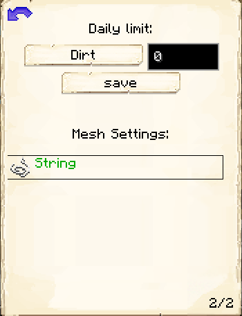

# Sifter's Hut

    
    

    

        

        
<strong>Worker:</strong>

        

        

        
<a href="../workers/sifter">Sifter</a>

        

    

    

    <recipe>sifter</recipe>

# About the Sifter's Hut

The Sifter's Hut is where the Sifter will sift through dirt, gravel, sand, or soul sand to find loot. Doing this will make the block the Sifter is sifting disappear. 

You can choose between four meshes. The higher the level of the mesh, the higher the likelihood that the Sifter will find loot.

| Hut Level | Mesh Available | 
| ----- | ----- | 
| 1         | String         | 
| 2         | Flint          | 
| 3         | Iron           | 
| 4         | Diamond        | 

| Sifted Block| Chance for |
| ----- | ----- |
| Dirt |	beetroot seeds
| Dirt |	carrot
| Dirt |	melon seed
| Dirt |	potato
| Dirt |	pumpkin seeds
| Dirt |	sapling: Oak
| Dirt |	sapling: Spruce
| Dirt |	sapling: Birch
| Dirt |	sapling: Jungle
| Dirt |	sapling: Acacia
| Dirt |	sapling: Dark Oak
| Dirt |	wheat seeds
| Gravel |	coal
| Gravel |	diamond
| Gravel |	dye: Lapis Luzuli
| Gravel |	emerald
| Gravel |	flint
| Gravel |	gold ingot
| Gravel |	iron ingot
| Gravel |	iron nugget
| Gravel |	redstone
| Sand |	cactus
| Sand |	dye: Cocoa Bean
| Sand |	gold nugget
| Sand |	reeds
| Soul Sand |	blaze powder
| Soul Sand |	glowstone dust
| Soul Sand |	magma cream
| Soul Sand |	nether wart
| Soul Sand |	quartz
| Soul Sand |	skull: Human

# Sifter Hut GUI

When accessing the Sifter's Hut block (right clicking on it), you will see a GUI with different options:

 

  

    
  

  

    
The Worker assigned and it's Level. (The worker levels up in time by doing it's work. The higher the level the faster and more efficient it will be). And the buttons:

    <ul>
      
        <li><strong>{{ item.button }}:</strong> {{ item.content }}</li>
      
    </ul>
  

 

  

    
  

  

    
<strong>Daily Limit</strong>:

    <ul>
     <li><strong>Item: </strong> You will have a list of Items to choose from, default is Dirt, Gravel, Sand, and Soul Sand, however you may see other options if the config file has been changed.</li>
     <li><strong>Amount</strong> You can choose how many of an item is sifted, this is based on the level of the hut. </li>
     <li><strong>Mesh Settings: </strong> If you have String, Flint, Iron Ingots, and/or Diamonds in your inventory, you will see the buy option beside the mesh type that you can purchase to change mesh types.</li>
    </ul>
  

  
  
   
  
### **To see build options please see the [Builder](../../source/workers/builder) Page**  

Page 2 of the GUI allows you to choose which block to sift, how many daily, and which mesh you want to use.

You must buy a mesh everytime you want to change it.

    
  

