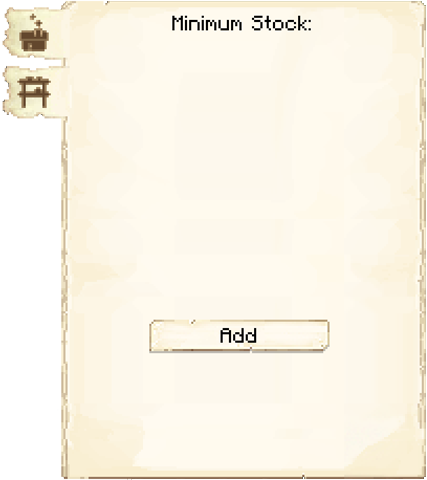

# Smeltery

    
    

    

        

        
<strong>Worker:</strong>

        

        

        
<a href="../workers/smelter">Smelter</a>

        

    

    

    <recipe>smeltery</recipe>

### Note: The Smeltery cannot be built until you have a level 2 [Mine](../../source/buildings/mine) (or two level 1 Mines) and have finished the research in the [University](../../source/buildings/university).
 

The Smeltery is where the Smelter will smelt ores into ingots.

**Hint:** The higher the level of the Smeltery, the more furnaces the Smelter will be able to use. A higher level will also have a higher chance to double and even triple the ingot output per block of ore. The Smelter's Strength level will sometimes determine the chance to double or triple the ingot output of ores, according to the Smeltery level. So:

| Building Level | Normal Output | % Chance of Doubling Output | % Chance of Tripling Output | Furnaces |
| :-----: | :-----: | :-----: | :-----: | :-----: |
| 1 | 100% | 1 in (100 - 50% of Strength Level) | ---------------------------------- | 1 |
| 2 | 100% | 1 in (100 - Strength Level)        | ---------------------------------- | 2 |
| 3 | ---- | 100%                               | ---------------------------------- | 3 |
| 4 | ---- | 100%                               | 1 in (100 - 50% of Strength Level) | 4 |
| 5 | ---- | 100%                               | 1 in (100 - Strength Level)        | 5 |

## Smeltery GUI

When accessing the Smeltery's hut block by right-clicking on it, you will see a GUI with different options:  

  

    
  

  

     
    <ul>
      
        <li><strong>{{ item.button }}:</strong> {{ item.content }}</li>
      
    </ul>
  

 

  

    
  

  

    <ul>
      <li><strong>Fuel: </strong>Listed here are items that can be used by the Smelter as fuel in their furnaces. Turn on any that you want your Smelter to use, and a Courier will deliver those items to the Smelter when they need fuel. (The black box at the top is to search for items.)
      </li>
    </ul>
  

  
 
 

  

    
  

  

    <ul>
      <li><strong>Smeltable Ore: </strong>Listed here are ores that can be smelted by the Smelter. You can click to turn each one on or off. All coded ores (even if they come from other mods) are automatically added to this list. If you have ores that are not on the list, they can be added to the <a href="../../source/misc/configfile">config file</a>. 
      </li>
    </ul>
  

 

  

    
  

  

    <ul>
        <li><strong> Minimum Stock: </strong> Use this button to tell the Smeltery to keep a minimum stock on hand. Set items will be displayed above the button.</li>
    </ul>
  

 
