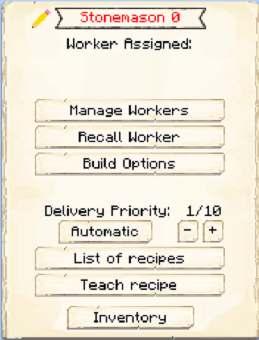

# Stonemason

    
    

    

        

        
<strong>Worker:</strong> <a href="../workers/stonemason">Stonemason</a>

        

    

    

    

        

        
<strong>Recipe:</strong> 
        

    

    <recipe>stonemason</recipe>
    

# About the Building

Once the building is built, begin teaching them the Stonemason recipes you would like them to create. 

Stonemason can learn 3x3 recipes made entirely out of cobble, stone, andesite, diorite, granite, sandstones, or materials oreDictionaried with stone. No quartz, purpure, or endstone. The Stonemason will work when they receive a request for any of those items for all of your Colony's needs.

**Hint:** Once the builder is done you will want to upgrade the Stonemason to get all the awesome perks it has to offer for higher levels. So:

| Building Level | Number of Recipes |
| :-----: | :-----: |
| 1 | 10 | 
| 2 | 20 |
| 3 | 40 |
| 4 | 80 | 
| 5 | 160 | 

## Stonemason Hut GUI

When accessing the Stonemason's Hut block (right clicking on it), you will see a GUI with different options:

 

  

    
  

  

    
The Worker assigned and it's Level. (The worker levels up in time by doing it's work. The higher the level the faster and more efficient it will be). And the buttons:

    <ul>
      
        <li><strong>{{ item.button }}:</strong> {{ item.content }}</li>
      
    </ul>
  

 
