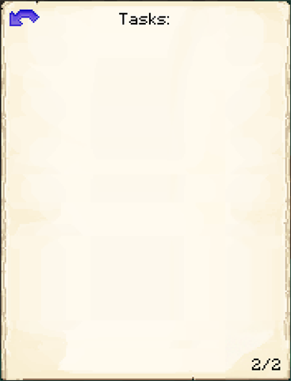

# Stonemason's Hut

    
    

    

        

        
<strong>Worker:</strong>

        

        

        
<a href="../workers/stonemason">Stonemason</a>

        

    

    

    <recipe>stonemason</recipe>

### Note: The Stonemason's Hut cannot be built until you have a level 1 [Blacksmith's Hut](../../source/buildings/blacksmith) and have finished the research in the [University](../../source/buildings/university).
 

The Stonemason's Hut is where the Stonemason will craft 3x3 recipes made entirely out of cobblestone, stone, andesite, diorite, granite, quartz, purpur, nether bricks, prismarine, sandstones, and/or ores (no ingots or redstone items). They can also craft end stone, but only if you have researched the Know the End research in the [University](../../source/buildings/university). The Stonemason will only work when they receive a request from another worker and have the needed materials. You will also need to teach the Stonemason's Hut the recipes you want the Stonemason to craft.

**Hint:** Upgrading the Stonemason's Hut lets you teach it more recipes. So:

| Building Level | Number of Recipes |
| :-----: | :-----: |
| 1 | 10 | 
| 2 | 20 |
| 3 | 40 |
| 4 | 80 | 
| 5 | 160 | 

## Stonemason's Hut GUI

When accessing the Stonemason's Hut block by right-clicking on it, you will see a GUI with different options:  

  

    
  

  

     
    <ul>
      
        <li><strong>{{ item.button }}:</strong> {{ item.content }}</li>
      
    </ul>
  

  
  

The 2nd page of the GUI shows what crafting task(s) the Stonemason currently has.

  

    
  

  

     
  

   
