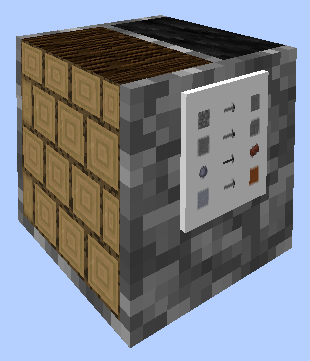
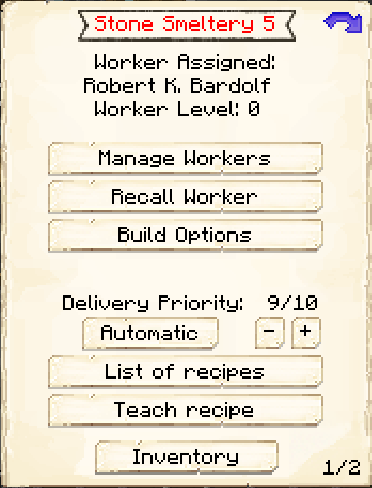
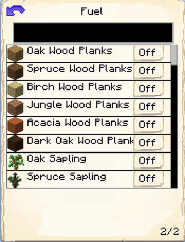

# StoneSmeltery

    
    

    

        

        
<strong>Worker:</strong>

        

        

        
<a href="../workers/stonesmelter">Stone Smelter</a>

        

    

    

    <recipe>stonesmeltery</recipe>

Welcome to the Stone Smeltery Information Site.

Before you choose a place to build the Stone Smeltery, take into account the location from Mine, Warehouse and/or other Worker(s). After you have selected a place for the Hut, you have to craft the Stone Smeltery's Hut block and place it with your [Building Tool](../items/buildingtool). Once the hut block is placed, the Stone Smelter will be automatically assigned (or you can manually assign one with the best  [Traits](../systems/workerinfo) for Stone Smelter if you changed this in the settings tab in the [Town Hall's GUI](../../source/buildings/townhall).

Now you will have to issue the builder the “Build” assignment so it can build the “Stone Smeltery’s Hut”. Once the builder is done you can now hire the Stone Smelter and they will, upon request, turn cobblestone to stone, stone bricks to cracked stone bricks, clay balls to brick, and clay blocks to terracotta for all your Towns needs.

**Hint:** Once the builder is done you will want to upgrade the Stone Smeltery to get all the awesome perks it has to offer for higher levels. The higher the level of the Hut the more furnaces the Smelter will be able to use. So:

| Building Level |  Furnace(s) |
| :-----: | :-----: | 
| 1 |  1 |
| 2 |  2 |
| 3 |  3 |
| 4 |  4 |
| 5 |  5 |

## Hut GUI

When accessing the Stone Smeltery's Hut block (right clicking on it), you will see a GUI with different options:

 

  

    
  

  

    
The Worker assigned and it's Level. (The worker levels up in time by doing it's work. The higher the level the faster and more efficient it will be). And the buttons:

    <ul>
      
        <li><strong>{{ item.button }}:</strong> {{ item.content }}</li>
      
    </ul>
  

  

    
  

  

    <ul>
      <ul><strong> Fuel: </strong> Listed are items that can be used by the cook as fuel in the furnaces. Simply turn on any that you want your cook to use, and the deliveryman will deliver those items to the cook when they need fuel.
      </ul>
    </ul>
  

  
  
   
  
### **To see build options please see the [Builder](../../source/workers/builder) Page**  

