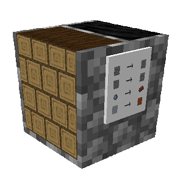
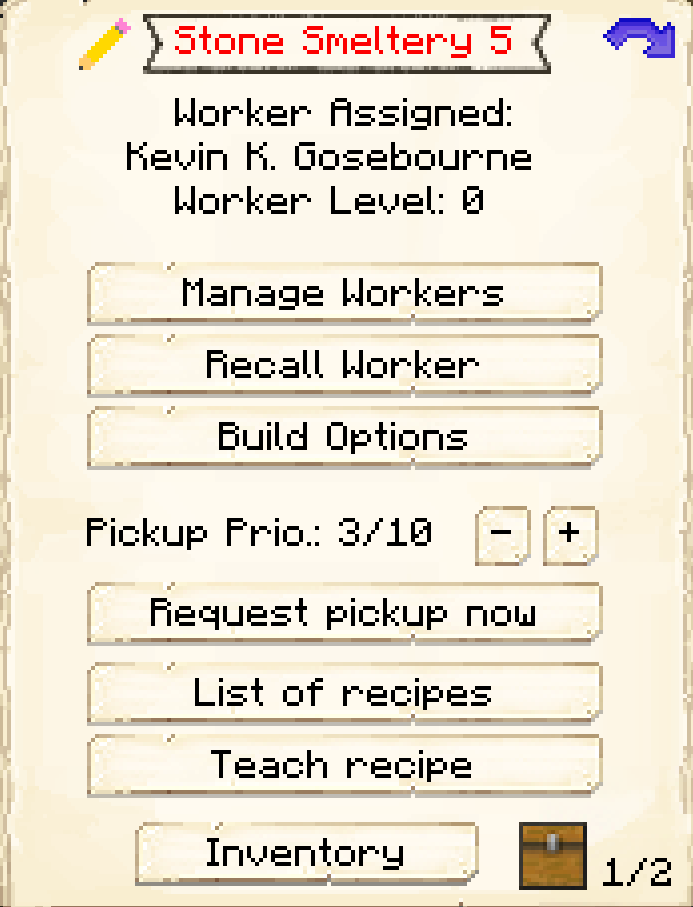

# Stone Smeltery

    
    

    

        

        
<strong>Worker:</strong>

        

        

        
<a href="../workers/stonesmelter">Stone Smelter</a>

        

    

    

    <recipe>stonesmeltery</recipe>

### Note: The Stone Smeltery cannot be built until you have a level 3 [Smeltery](../../source/buildings/smeltery) (or three level 1 Smelteries, or another equivalent) and have finished the research in the [University](../../source/buildings/university).
 

The Stone Smeltery is where the Stone Smelter will smelt cobblestone into stone, stone bricks into cracked stone bricks, clay balls into bricks, clay blocks into terracotta, terracotta into glazed terracotta, all types of stone into all types of smooth stone, and logs into charcoal. They can also pop chorus fruits! The Stone Smelter will only work when they have been taught the recipe, receive a request from another worker, and have the needed materials. 

**Hint:** The higher the level of the Stone Smeltery, the more furnaces the Stone Smelter will have available. The number of furnaces they *use* depends on their Athletics level. So:

| Building Level |  Furnaces |
| :-----: | :-----: | 
| 1 |  1 |
| 2 |  2 |
| 3 |  3 |
| 4 |  4 |
| 5 |  5 |

**Hint:** The higher the Stone Smelter's Dexterity level, the faster things will smelt. At high levels, they can go *much* faster than the player!

## Stone Smeltery GUI

When accessing the Stone Smeltery's hut block by right-clicking on it, you will see a GUI with different options:

 

  

    
  

  

     
    <ul>
      
        <li><strong>{{ item.button }}:</strong> {{ item.content }}</li>
      
    </ul>
  

 

  

    
  

  

    <ul>
      <li><strong>Fuel: </strong>Listed here are items that can be used by the Stone Smelter as fuel in their furnaces. Turn on any that you want your Stone Smelter to use, and a Deliveryman will deliver those items to the Stone Smelter when they need fuel. (The black box at the top is to search for items.)
      </li>
    </ul>
  

  
  
   
