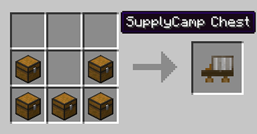
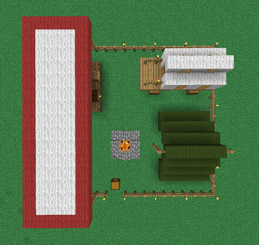
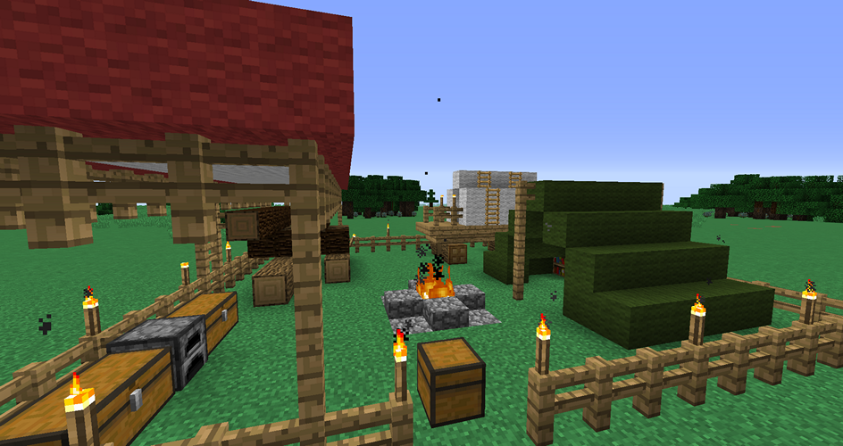

# Supply Camp

The Supply Camp is one of the two options to to start playing Minecolonies. The first step is to craft the Supply Camp block. 

The Suppy Camp is one of the *ONLY* two ways to obtain the Town Hall block. It is a great Supply of materials for you to start as well as a very illuminated place to live while you get your Town started. You have many chests, bed, bookshelves, torches, wool, etc etc. What else could the Camp contain... hhmmmm maybe some treasure as well? 

## Placement of the Supply Camp

When you place the Supply Camp it will spawn a chest that will contain the [Town Hall](../buildings/townhall) block and the [Building Tool](../../source/tutorials/building_tool). To place the Supply Camp, you need to have a large enough flat, clear piece of land. The recommended flat piece of land must be at least 17 x 17 blocks in size. You can make and use the Building Tool to place the Supply Camp so you can see a 3D image and you can move it around to the exact place and orientation you want it. But please take into account the Town Hall placement as well before you place your Supply Camp. *Once the Supply camp is placed, you can't place another Camp or Ship in this World anymore.*

- **Hint:** if you’re not able to place the Supply Camp, try it block by block: one to the right, left, closer of further from the area you cleared. It can not contain any holes or have any flowers, grass, ferns, etc. It must be completely flat and clear. If it's not dirt, then either dig a 17 x 17 x 1 hole so it can be placed at ground level or place it 1 block above ground.

     

**Here are some screenshots for your viewing pleasure:**

  
  

