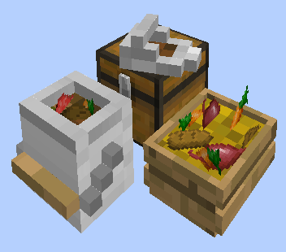
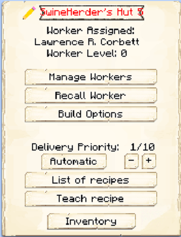

# Swine Herder's Hut

    
    

    

        

        
<strong>Worker:</strong>

        

        

        
<a href="../workers/swineherder">Swine Herder</a>

        

    

    

    <recipe>swineherder</recipe>

Welcome to the Swine Herder's Information Site.

Before you choose a place to build the Swine herder's Hut, take into account the location from the Restaurant, Warehouse and/or other Herder(s). After you have selected a place for the hut you have to craft the Swine Hut block and place it with the [Building Tool](../items/buildingtool). Once the Swine Hut is placed, the Herder will be automatically assigned (or you can manually assign one with the best [Traits](../systems/workerinfo) for a Herder if you changed this in the settings tab in the [Town Hall's GUI](../../source/buildings/townhall).

Now you will have to issue the builder the “Build” assignment so it can build the “Swine Herder’s Hut”. Once the builder is done, you will have to capture and bring in 2 Pigs to the herder's hut. The herder will not catch and bring in any Pigs, only breed and butcher the ones in his hut area, so make sure you provide it with 2 initial Pigs.

**Note:** The Herder will only keep alive 2 Pigs per hut level, so at level 5 they will have 10 Pigs in their holding pens alive to breed and butcher. This means they will keep *MORE* and have faster production and collection of meats, drops and by products. So:

| Building Level | Pigs "Housed" |
| ----- | ----- |
| 1 | 2 |
| 2 | 4 |
| 3 | 6 |
| 4 | 8 |
| 5 | 10 |

  

Now you can access the Swine Herder's Hut block (right click on it) and you will see a GUI with different options:  

  

    
  

  

    
The Worker assigned and it's Level. (The worker levels up in time by doing it's work. The higher the level the faster and more efficient they will be). And the buttons:

    <ul> 
      
        <li><strong>{{ item.button }}:</strong> {{ item.content }}</li>
      
    </ul>
  

  
  
   
  
### **To see build options please see the [Builder](../../source/workers/builder) Page**  

