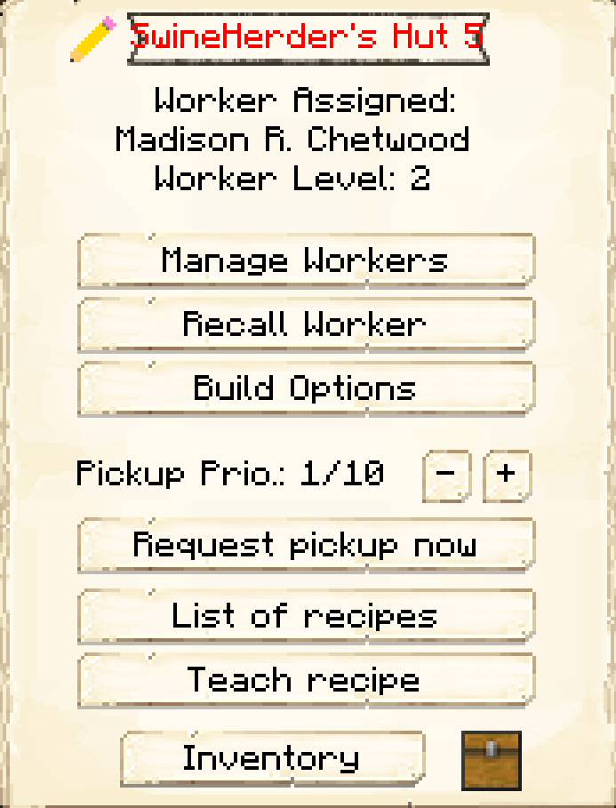

# Swine Herder's Hut

    
    

    

        

        
<strong>Worker:</strong> <a href="../workers/swineherder">Swine Herder</a>

        

    

    

    

        

        
<strong>Recipe:</strong> 
        

    

    <recipe>swineherder</recipe>
    

# About the Building

Once the building is built, you will have to capture and bring in 2 Pigs to the herder's hut. The herder will not catch and bring in any Pigs, only breed and butcher the ones in his hut area, so make sure you provide it with 2 initial Pigs.

**Note:** The Herder will only keep alive 2 Pigs per hut level, so at level 5 they will have 10 Pigs in their holding pens alive to breed and butcher. This means they will keep *MORE* and have faster production and collection of meats, drops and by products. So:

| Building Level | Pigs "Housed" |
| ----- | ----- |
| 1 | 2 |
| 2 | 4 |
| 3 | 6 |
| 4 | 8 |
| 5 | 10 |

 

# Swine Herder Hut GUI

Now you can access the Swine Herder's Hut block (right click on it) and you will see a GUI with different options:

 

  

    
  

  

    
The Worker assigned and it's Level. (The worker levels up in time by doing it's work. The higher the level the faster and more efficient they will be). And the buttons:

    <ul> 
      
        <li><strong>{{ item.button }}:</strong> {{ item.content }}</li>
      
    </ul>
  

  
