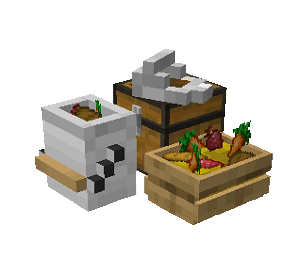

# Swine Herder's Hut

    
    

    

        

        
<strong>Worker:</strong>

        

        

        
<a href="../workers/swineherder">Swine Herder</a>

        

    

    

    <recipe>swineherder</recipe>

# About the Swine Herder's Hut

The Swine Herder's Hut is where the Swine Herder will breed and butcher pigs for food. You will have to capture and bring in two pigs to the Swine Herder's Hut, as the Swine Herder will not catch and bring in any pigs.

**Note:** The Swine Herder will only keep alive two pigs per hut level, so at level 5 they will have ten pigs in their holding pens to breed and butcher. This means they will be faster at producing and collecting meat. So:

| Building Level | Pigs Housed |
| ----- | ----- |
| 1 | 2 |
| 2 | 4 |
| 3 | 6 |
| 4 | 8 |
| 5 | 10 |

  

# Swine Herder's Hut GUI

When accessing the Swine Herder's Hut block by right-clicking on it,  you will see a GUI with different options:

  

    
  

  

      
    <ul>
      <li><strong>Swine Herder's Hut 5:</strong> This tells you the building you have selected is a Swine Herder's Hut with build level 5.</li>
      <li><strong>Worker Assigned:</strong> Tells you the worker assigned to the Swine Herder's Hut and their worker level. The worker levels up in time by working. The higher the level, the faster and more efficient they will be.</li>
          <li><strong>Manage Workers:</strong> Lets you change which worker is assigned to be the Swine Herder. There can only be one Swine Herder at a time. <b>Note:</b> this only works if you have turned the worker hiring mode in the [Town Hall](../../source/buildings/townhall) block to manual, otherwise your citizens will be hired automatically.</li>
      <li><strong>Recall Worker:</strong> Recalls the Swine Herder to their hut block. You might use it if they are stuck somewhere, you want to see what they have, or want to give them something directly.</li>
      <li><strong>Build Options:</strong> Lets you create a build, upgrade, reposition, or repair build order for the Swine Herder's Hut. To learn more about the building system, please visit the [Builder](../../source/workers/builder) page.</li>
      <li><strong>Delivery Priority:</strong> You can set the priority that a [deliveryman](../../source/workers/deliveryman) will deliver requested materials and take meat to the [warehouse](../../source/buildings/warehouse) (ten is the highest, one is the lowest). You can also set whether it is automatic, meaning it changes automatically based on if the Swine Herder has any requests (among other factors), or static, meaning it stays to what you set it no matter what.</li>
      <li><strong>List of Recipes and Teach Recipe:</strong> When clicking the list of recipes button, you see all the recipes you have taught this Swine Herder's Hut and can remove them. When clicking teach recipe, it opens a 3x3 crafting grid which allows you to teach this hut recipes (not the worker). <b>Note:</b> you don't need to teach the Swine Herder's Hut any recipes for the Swine Herder to do their job.</li>
      <li><strong>Inventory:</strong> Here you can access the hut block's storage, where the Swine Herder takes their materials and deposits their meat. They will also use any [racks](../../source/decoblocks/rack) or chests in the hut, so be sure to check those as well!</li>
    </ul>
  

   
