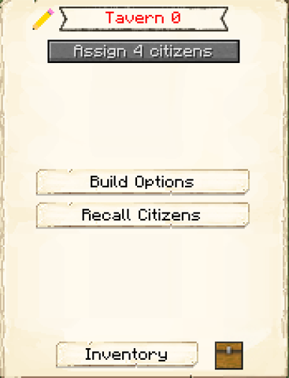

# Tavern

    
    

    <recipe>tavern</recipe>

The Tavern is like a [Citizen's Hut](../../source/buildings/citizenhut) in that it houses citizens, however, the Tavern houses four instead of one and can't be upgraded to house more.

Every so often, travelers will come to the Tavern. You can recruit these travelers (with items) to live and work in your colony. This function used to be part of the [Town Hall](../../source/buildings/townhall) but has been moved here. 

<strong>Note:</strong> The Tavern can only be upgraded to level 3, not level 5. You can also only have 1 Tavern per colony.

 

## Tavern GUI

When accessing the Tavern's hut block by right-clicking on it, you will see a GUI with different options:

  

    
  

  

     
    <ul>
      
        <li><strong>{{ item.button }}:</strong> {{ item.content }}</li>
      
    </ul>
  

  
  
