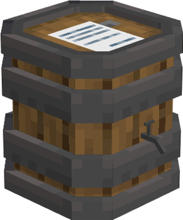

# Tavern

    
    

    <recipe>tavern</recipe>

# About the Tavern Hut

The Tavern currently only temporarily houses four citizens, but additional functionality will be added at a later date

 

# Tavern GUI

When accessing the Tavern block by right-clicking on it, you will see a GUI with different options:

  

    
  

  

     
    <ul>
      
        <li><strong>{{ item.button }}:</strong> {{ item.content }}</li>
      
    </ul>
  

  
  
