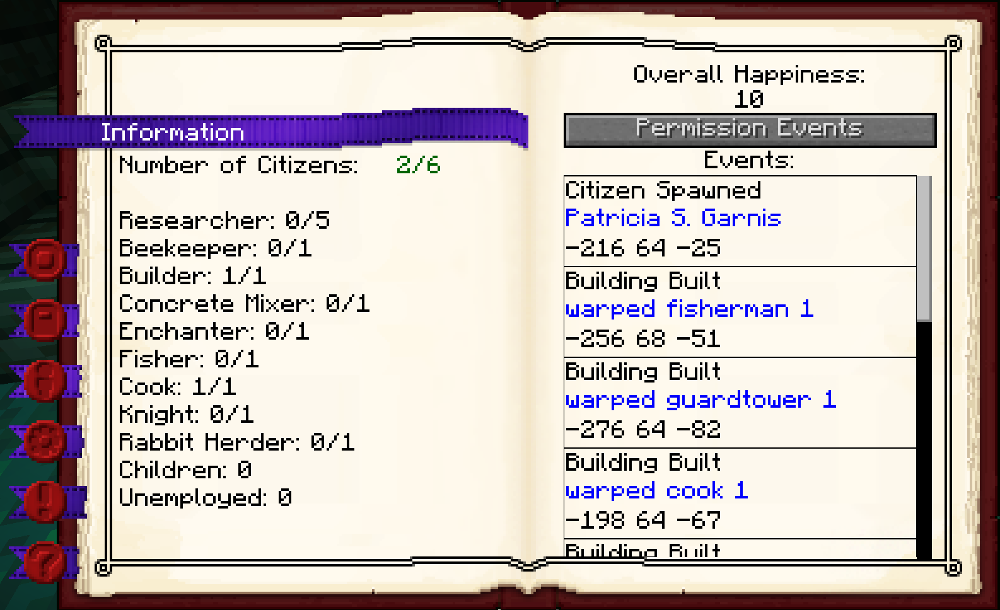

# Town Hall

<div class="infobox box text-center">
    
    <hr />
    <recipe>townhall</recipe>
</div>

The Town Hall is the central part of your colony.

**Note:** The Town Hall block **cannot** be crafted until **after** you have already placed the Town Hall you get from the [Supply Ship/Camp](../../source/items/supplycampandship). If needed, it can also be obtained in Creative like any other block or by commands (check our [Commands](../systems/commands) page).

## Starting a New Colony

### Scouting the Area

Make sure you scout your area carefully before you decide where you want to place your Town Hall. Your colony will start with a 4 chunk radius (4 chunks in each direction) from the Town Hall block. Make sure this is where you want your colony to be.

### Placing your Town Hall

After you have carefully decided where you want to place your Town Hall (remember, the position where you placed the Town Hall block will be the center of your colony's protected area. Once placed, the area will be set and cannot be changed), use your [Building Tool] (../items/buildingtool) to place the Town Hall block.

Right-click the ground in the area you want to place the Town Hall. The building GUI will display showing the 3D preview of the building. You will be able to use the arrow buttons to move the building to the location you desire. 

**Note:** Make sure you use the + and - options in the GUI to make sure you have the ground level of the hut where you want the ground level to be. Not all hut blocks sit on the ground.

Once you commit to the placement of the Town Hall (green checkmark), the Town Hall block will be placed.

### Creating your Colony

Once you have placed the Town Hall block you will need to right-click on it and select Create New Colony.


A new colony will be created, the area of your colony will be established, and the entire area will be protected.

### Protection Area

When you start a colony, the area that is initially set also has protections added to it. The protection system includes blocking any player from placing/breaking or interacting with blocks of any kind, placing lava or water, and placing/lighting TNT. Once established it will also show in the informational screen.

The protected area of your colony (once the Town Hall has been placed) will depend on the configuration, but will be 4 chunks radius by default, measured from where you placed your Town Hall block the first time. Therefore, plan carefully where you want to place your Town Hall. Your protected colony area includes mountains, hills, lakes, oceans, caves, world generated structures, etc. from bedrock to the sky limit.

Due to the protected area of each colony, you have to carefully scout your surroundings to make sure you are clear of any other colonies nearby preventing you from placing your Town Hall or limiting your colony area in that direction.

**Note:** Once you place your Town Hall block this will be the CENTER of your Town's protected radius. If you decide that you want your actual Town Hall building to be built in a different location (within your currently set protected radius), you can break the block and place it again with your Building Tool. Removing and replacing the Town Hall block will NOT remove the Protected area of your Town. The only way to remove the protected area of your colony so that you can place a Town Hall somewhere else is by a person with /op or /admin permission deleting your colony through [Commands](../systems/commands). 

- **Note**: You can configure your own colony area radius in the configuration options of the mod or the the minecolonies-common.toml file inside the ```../config/``` folder of your own world. (see Minecolonies config server section for details)

If there is another colony too close to your current position you won't be able to place a Town Hall.

If you try to place another Town Hall outside of your protected area, you will get a message: <br> 


# Town Hall GUI

<li><i>You can use the tabs on the left side to switch between different categories.</i></li>

<br>

## <strong>Information:</strong> This is the overall information section of the Town Hall GUI.
   
<div class="row">
  <div class="col-sm-12 col-md">
    
  </div>
  <div class="col-sm-12 col-md">
    <ul>
     <li><strong>Page 1: </strong>Here you will see some statistics on your citizens, like the number of citizens you have and if they are unemployed or workers.</li>
     <br>
     <li><strong>Page 2: </strong>Here you will see the overall happiness of the colony's citizens as well as any events that the colony is having (future use).</li>
    </ul>
  </div>
</div>
<br>
<br>

## <strong>Actions:</strong> This is the most important section.

<div class="row">
  <div class="col-sm-12 col-md">
    
  </div>
  <div class="col-sm-12 col-md">
    <p><strong>Page 1: </strong>Here you will see the name of your colony. And the buttons:</p>
    <ul>
     <li><strong>Build Options-</strong>Lets you create a build, upgrade, reposition, or repair build order for the Town Hall. To learn more about the building system, please visit the [Builder](../../source/workers/builder) page.</li><br>
     <li><strong>Recall Citizens-</strong>So you can make <i>ALL</i> citizens (workers or unemployed) teleport to the Town Hall block.</li><br>
     <li><strong>Toggle Specialization-</strong>For future use, has no purpose at the moment.</li><br>
     <li><strong>Rename Colony-</strong>To change the name of your colony (from Your Username's Colony, which is the default) to anything you want.</li>
    </ul>
   <p><strong>Page 2: </strong>This is for the PVP part of the mod. Here you have:</p>
    <ul>
     <li><strong>Allies-</strong>Other colonies that you have added as allies and that have confirmed your colony as an ally as well.</li><br>
     <li><strong>Feuds-</strong>Other colonies that you have added as a feud and that have confirmed your colony as a feud as well.</li>
    </ul>
  </div>
</div>
<br>
<br>

## <strong>Permissions:</strong> Here you can invite other players to your colony to collaborate. 

<p><strong>Permissions Pg. 1 & 2: </strong>You can add a player and give him a <i>rank</i> in your Town. Each rank will have certain privileges in the protection system that you can configure.</p>

<div class="row">
  <div class="col-sm-12 col-md">
    
  </div>
  <div class="col-sm-12 col-md">
    <ul>
     <li><strong>Page 1: </strong>Here you can type the name of the player you want to add and decide which rank you want them to be. You can choose from Officer, Friend, Neutral, or Hostile.</li><br>
     <li><strong>Page 2: </strong>Shows the list of players that have ben added as well as their current rank. You can click on the "-" or "+" to give them a higher rank or a lower rank.</li>
    </ul>
  </div>
</div>  

---
<p><strong>Permissions Pg. 3 & 4: </strong>Here you can manage the permissions for each rank.</p>

<div class="row">
  <div class="col-sm-12 col-md">
    
  </div>
  <div class="col-sm-12 col-md">
    <ul>
     <li><strong>Page 3: </strong>Here you can select each rank that you would like to manage.</li><br>
     <li><strong>Page 4: </strong>Here are the individual permissions (for the rank you have selected on the previous page) tha you can toggle <i>ON</i> or <i>OFF</i>, giving each rank the permission <b>you</b> want.</li>
    </ul>
  </div>
</div>  

---
<p><strong>Permissions Pg. 5 & 6: </strong>In this section you can add a certain block's position that will bypass the protection system for interaction. Any player will be able to interact with that block regardless of their rank in your colony.</p>

<div class="row">
  <div class="col-sm-12 col-md">
    
  </div>
  <div class="col-sm-12 col-md">
    <ul><br>
     <li><strong>Page 5: </strong>The field where you can enter the position (X, Y, Z) of the block that you want to make free for interaction.</li><br>
     <li><strong>Page 6: </strong>Here you will see the list of block positions that you have added as free for interaction.</li>
    </ul>
  </div>
</div>
<br>
<br>

## <strong>Citizens: </strong>This section displays the names and skill levels of the citizens in your Colony.

<div class="row">
  <div class="col-sm-12 col-md">
    
  </div>
  <div class="col-sm-12 col-md">
    <ul>
     <br>
     <li><strong>Page 1: </strong>When you select a citizen, their stats will appear here.</li><br>
     <li><strong>Page 2: </strong>Here you will see a list of the citizens in your colony. Select a citizen to see their skill levels.</li>
    </ul>
  </div>
</div>
<br>
<br>

## <strong>Settings: </strong>This section is where you can control how your citizens will be hired and assigned housing in your colony, among other things.

<div class="row">
  <div class="col-sm-12 col-md">
    
  </div>
  <div class="col-sm-12 col-md">
    <ul>
    <br>
     <li><strong>Page 1: </strong>There are two buttons here:</li>
       <ul>
       <br>
        <li><strong>Worker hiring mode: </strong>Clicking on this button lets you switch between automatic or manual. If it's in automatic mode, you can't fire or hire any citizen from any worker hut and the best unemployed citizen will be hired for you. In manual mode you will be able to <i>hire</i> and <i>fire</i> whichever citizen you want at any time.</li><br>
        <li><strong>Housing assignment mode: </strong>Clicking on this button lets you switch between automatic or manual. If it's in automatic mode, citizens will be assigned a house as soon as they spawn (if housing is available). In manual mode, you can select which citizens will be housed in each [Citizen's Hut](../../source/buildings/citizenhut). This is better if you have a large colony and many workers spread out in a large area, so you can house your citizens as close as possible to their workplace.</li>
       </ul>
     <li><strong>Page 2: </strong>Pick Team Color: Whatever color you pick from here, your guards will have a glow of this color around them when you put them in follow mode at their [Guard Tower](../../source/buildings/guardtower). This is for the PVP system so you know which guards are yours when you are fighting. Your citizens' names will also be in this color when looking at them.</li>
    </ul>
  </div>
</div>
<br>
<br>

## <strong>Work Orders: </strong>Here you will see the work orders your [Builders](../../source/workers/builder) have in the order they have been assigned. Builders will not start another order until they have successfully completed the top one.

<div class="row">
  <div class="col-sm-12 col-md">
    
  </div>
  <div class="col-sm-12 col-md">
    <ul>
     <br>
     <li><strong>Page 1: </strong>Blank page except for the header (future use).</li><br>
     <li><strong>Page 2: </strong>Here are all the build orders listed that have been created by you (including decorations and your own schematics as well as the mod's huts). Your Builders will complete the builds from top to bottom. Here you can  the priority of the builds and delete work orders. When you delete a work order which is currently being built, the Builder will stop building and will continue where he left off if you create the work order again.</li>
    </ul>
  </div>
</div>
<br>
<br>

## <strong>Happiness: </strong>This is the section for the global happiness of your colony so you can see what area needs more attention to raise the happiness level.

<div class="row">
  <div class="col-sm-12 col-md">
    
  </div>
  <div class="col-sm-12 col-md">
    <ul>
     <br>
     <li><strong>Page 1: </strong>The happiness indices. You can keep track of the 3 main areas that will lower or raise the happiness of your colony here. There are 3 colors: Green (everything is fine), Orange (needs attention as it's below optimal level), Red (immediate attention is needed-it's at a critically low level).</li><br>
     <li><strong>Page 2: </strong>Intentionally blank for now (future use).</li>
    </ul>
  </div>
</div>  

---  
  
  <br>
  
