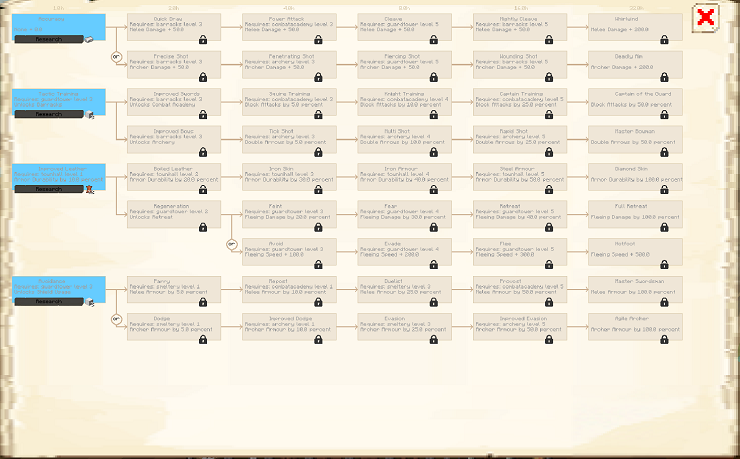

# University

    
    

    

        

        
<strong>Worker:</strong>

        

        

        
<a href="../workers/researcher">Researcher</a>

        

    

    

    <recipe>university</recipe>

# About the Building

## Note: The Research tree is still being worked on so the images may change.

Once the building is built, the researcher can now begin researching various upgrades. 

# University Hut GUI

When accessing the University's Hut block (right clicking on it), you will see a GUI with different options:

 

  

    
  

  

    
The Worker assigned and it's Level. (The worker levels up in time by doing it's work. The higher the level the faster and more efficient it will be). And the buttons:

    <ul>
      
        <li><strong>{{ item.button }}:</strong> {{ item.content }}</li>
      
    </ul>
  

 

 

  

    
  

    
 Page 2 of the GUI will show you the options for each research tree: 

    
 
    
Once you click on a Research Branch, you will see the options for each research tree:

 

  
  
    
    

    
 Each option will tell you the requirements and tell you how long it takes to research that option. (Time is in real world time spent in game.)

 

 
 
