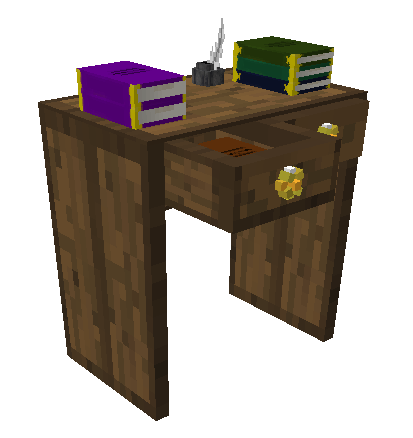
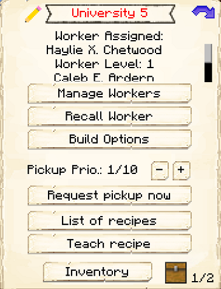
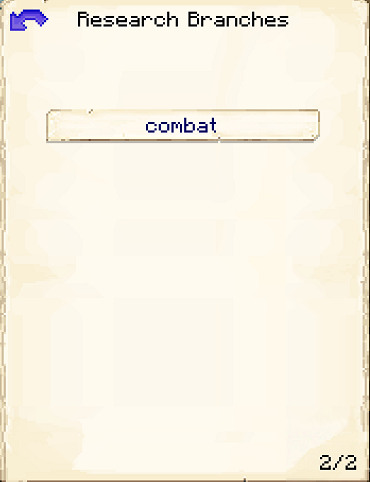
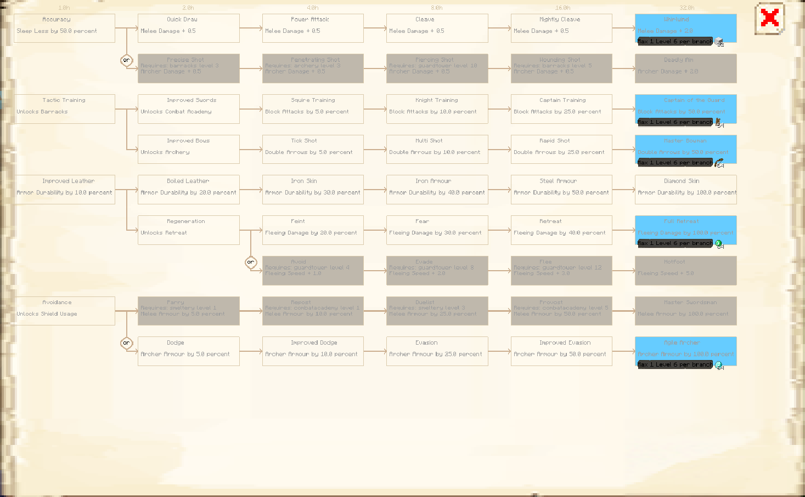
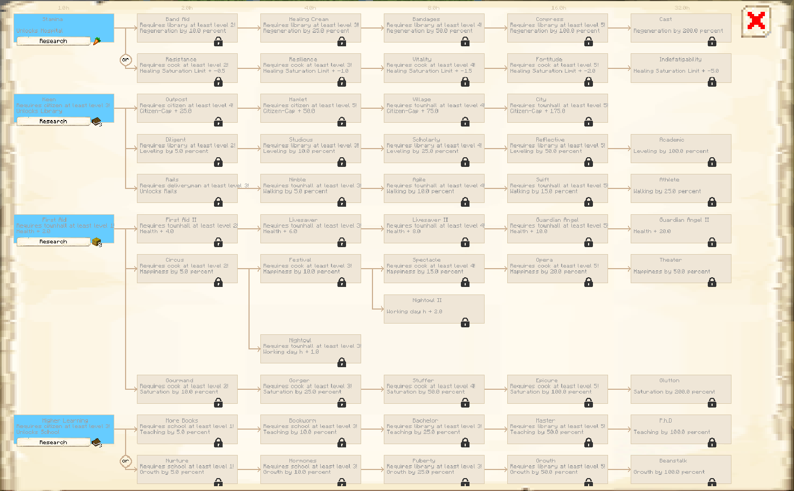
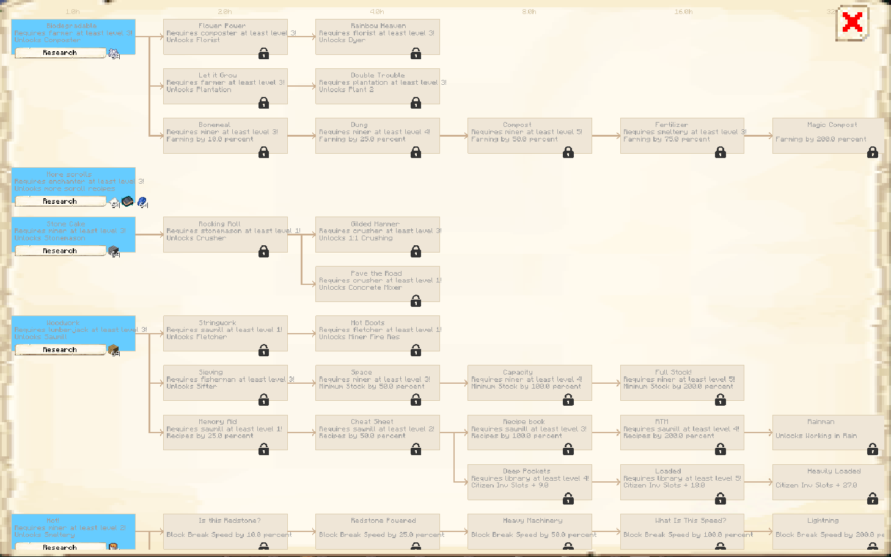

# University

    
    

    

        

        
<strong>Worker:</strong>

        

        

        
<a href="../workers/researcher">Researcher</a>

        

    

    

    <recipe>university</recipe>

# About the University

The University is where a researcher will research various upgrades to your colony. 

## University GUI

When accessing the University's hut block by right-clicking on it, you will see a GUI with different options:

 

  

    
  

  

     
    <ul>
      
        <li><strong>{{ item.button }}:</strong> {{ item.content }}</li>
      
    </ul>
  

 

 

Page 2 of the GUI will show you the options for each research branch.

  

    
  

    
 
    
Once you click on a research branch, you will see the options for each research tree. Each option will tell you the requirements and how long it takes to research that option. (Time is real-world time spent in-game.)

 

 

  
 
 
 
  
 
