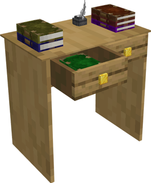

# University

    
    

    

        

        
<strong>Worker:</strong>

        

        

        
<a href="../workers/researcher">Researcher</a>

        

    

    

    <recipe>university</recipe>

The University is where a Researcher will research various upgrades to your colony. 

## University GUI

When accessing the University's hut block by right-clicking on it, you will see a GUI with different options:

 

  

    
  

  

     
    <ul>
      
        <li><strong>{{ item.button }}:</strong> {{ item.content }}</li>
      
    </ul>
  

 

 

Page 2 of the GUI will show you the options for each research tree.

  

    
  

    
 
    
Once you click on a research tree, you will see the options for each research branch. Each option will tell you the requirements and how long it takes to research that option. (Time is real-world time spent in-game.)

To see a description of each of the researches, please visit the [Research System](../../source/systems/research) page.
