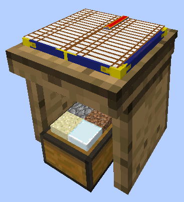
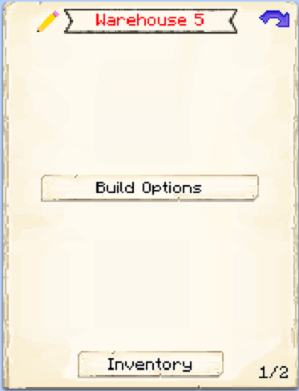
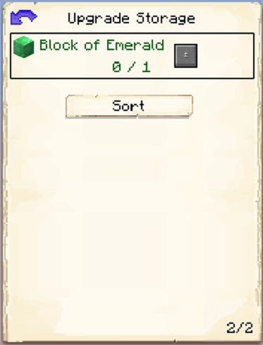

# Warehouse

    
    

    

        

        
<strong>Requires:</strong>

        

        

        
<a href="../buildings/deliveryman">Deliveryman's Hut</a>

        

    

    

    <recipe>warehouse</recipe>

The Warehouse is the central place to hold and retrieve ALL of your materials and tools that are made and gathered by all of your workers. It is the central storage from where the [Deliveryman](../../source/workers/deliveryman) will store and retrieve everything your workers harvest, craft or need. After you have crafted the Warehouse block, use your [Building Tool](../items/buildingtool) to place the building.

The building will hold ALL the materials and tools that are made/mined/harvested by all your workers. Level up the Warehouse to increase the storage capacity.

The level of the Warehouse will determine how many Deliverymen will be able to use the warehouse at the same time. Level up the Warehouse to increase the amount of [Deliverymen](../../source/workers/deliveryman) that will work in your Warehouse.  

| Building Level | Max Deliverymen |
| ----- | ----- |
| 1 | 1 |
| 2 | 2 |
| 3 | 3 |
| 4 | 4 |
| 5 | 5 |  

## Hut GUI

When accessing the Warehouse's Hut block (right clicking on it) you will see a GUI with different options:  

  

    
  

  

    
 This the GUI for the Citizen's Hut. It show the build "level" of the Hut. And the buttons:

    <ul>
      <li><strong>Build/Upgrade Building.- </strong>to create the build/upgrade work order for this building.</li>
      <li><strong>Repair Building.- </strong> So the builder can recreate the original building (at the current level) and fix any broken, missing, unwanted addons to the original building.</li>
      <li><strong>Inventory.- </strong>This is just an Inventory space where you can store anything you like. Here you can access the buildings storage.</li>
    </ul>
  

  

By pressing the arrow button in the top right corner of the GUI, you will be taken to page 2 of the GUI where you will find:  

  

    
  

  

    <ul>  
      <li><strong>Block of Emerald:</strong> You can upgrade the amount of storage the Warehouse has to <i>Double</i> it's capacity by pressing this button and giving it 1 block of emerald. This can <b>ONLY</b> be done when the warehouse is at <b>Level 5</b> build.</li>
    </ul>
  

  
  
   
  
### **To see build options please see the [Builder](../../source/workers/builder) Page**  

