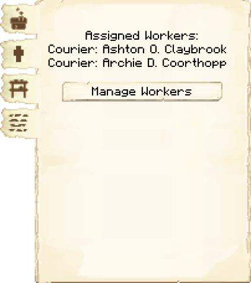
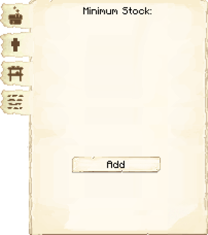

# Warehouse

    
    

    

        

        
<strong>Worker:</strong>

        

        

        
<a href="../workers/courier">Courier</a>

        

    

    

    <recipe>warehouse</recipe>

The Warehouse is the central storage from where a [Courier](../../source/workers/courier) will store and retrieve everything your workers harvest, craft, or need. Items will be stored in [racks](../../source/items/rack).

The level of the Warehouse will determine how many Couriers will be able to use it at the same time. Level up the Warehouse to increase the amount of Couriers that can work in it. Leveling up the Warehouse will also increase its storage capacity.

| Building Level | Max Couriers |
| -----  | ------ |
| 1 | 2  |
| 2 | 4  |
| 3 | 6  |
| 4 | 8  |
| 5 | 10 |  

### Note: You can only have one Warehouse per colony, unless you change this in the config file.

## Warehouse GUI

When accessing the Warehouse's hut block by right-clicking on it, you will see a GUI with different options:  

  

    
  

  

     
    <ul>
      <li><strong>Build Options: </strong>Lets you create a build, upgrade, reposition, or repair build order for the Warehouse. To learn more about the building system, visit the <a href="../../source/workers/builder">Builder</a> page.</li> 
      <li><strong>Inventory: </strong>This is an inventory space where you can store anything you like. The Couriers don't deposit things here (they use the <a href="../../source/items/rack">racks</a> in the Warehouse instead).</li>
    </ul>
  

  

By pressing the arrow button in the top right corner of the GUI, you will be taken to page two of the GUI:  

  

    
  
 
  

    <ul>
      <li><strong>Block of Emerald: </strong>You can increase the max amount of stacks in each rack by pressing this button. This can only be done when the Warehouse is at level 5 and you have at least one block of emerald in your inventory.</li> 
      <li><strong>Sort: </strong>The sort option is available when the Warehouse reaches level 3. It sorts and stacks all the items in the racks.
    </ul>
    
This is page three of the Warehouse GUI.

  

    
  

  

      <ul>
      <li><strong> Minimum Stock: </strong> Use this button to tell the Warehouse to request a minimum stock to keep on hand. If a worker requests an item that is set as the minimum stock, the minimum stock will be given to them but the Warehouse will request more if it no longer has enough. Set items will be displayed above the button.
      </ul>
    
  
   
