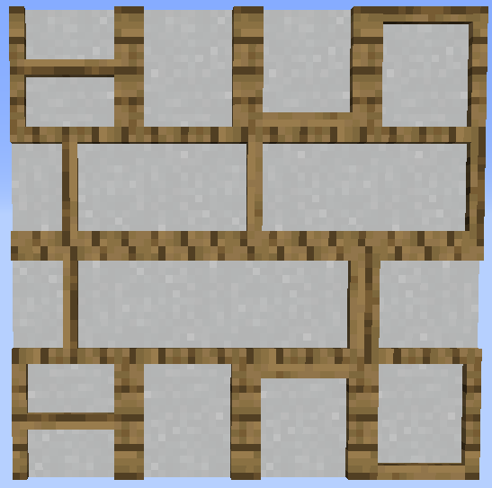

# Timber Frame Base (Plain)

    

<strong>Recipe:</strong> 
    <recipe>plaintimberframe</recipe> **Note:** Top is the outside frame, Middle is the inside.
    
<strong>Recipe:</strong> 
    <recipe>doublecrossed</recipe>
    
<strong>Recipe:</strong> 
    <recipe>framed</recipe>
    
<strong>Recipe:</strong> 
    <recipe>sideframed</recipe>
    
<strong>Recipe:</strong> 
    <recipe>upgate</recipe>
    
<strong>Recipe:</strong> 
    <recipe>downgate</recipe>
    
<strong>Recipe:</strong> 
    <recipe>left_right_crossed</recipe>
    
<strong>Recipe:</strong> 
    <recipe>right_left_crossed</recipe>
    
<strong>Recipe:</strong> 
    <recipe>horizontal_framed</recipe>
    
<strong>Recipe:</strong> 
    <recipe>horizontal_side_framed</recipe>
    
<strong>Recipe:</strong> 
    <recipe>plaintimberframealt</recipe>

 

## The Item
 
The Timberframe blocks are new blocks added with Structurize. The Timberframes come in various wood frames surrounding not only wood centers but also cobblestone, stone, paper and bricks. (The outside frames are only in wood.) 

Once you have the Plain Timberframe made with the combination you want, to get the other layouts of the frames (2nd and 3rd pictures above), all you need to do is put the Plain Timberframe in the crafting table to get the Double Crossed version, then for the next one, put the Double Crossed version in the Crafting table. and continue until you get to the one you want. You can even put the Horizontal Side Framed version in and get a Plain Timberframe back. 

 

## Using the Shingles

To use the Timberframes simply put them where you want them, however, the 3rd picture above shows the frames that are directional, meaning they change orientation depending on how you place them. 

The top row us placed from below at a sharp angle (meaning you have to be well below the block and nearly putting it up above your head.

The second row is placed facing the right at a sharp angle.

The third row is placed facing the left at a sharp angle.

The bottom row is placed looking down at a sharp angle.)