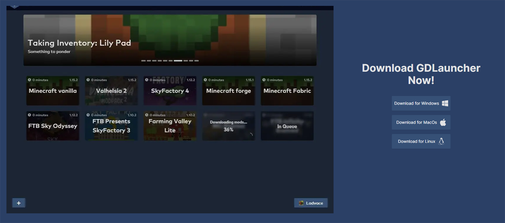
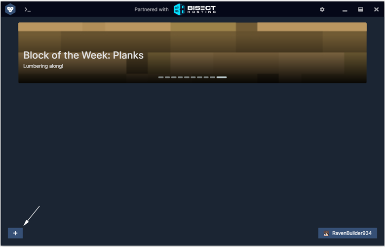
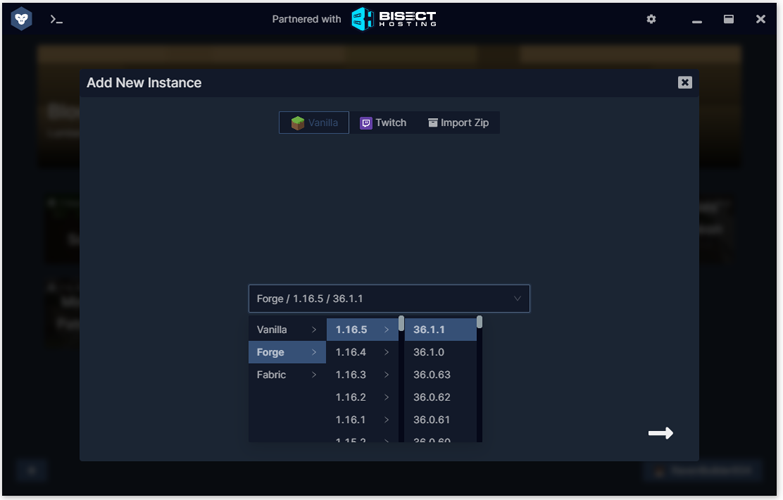
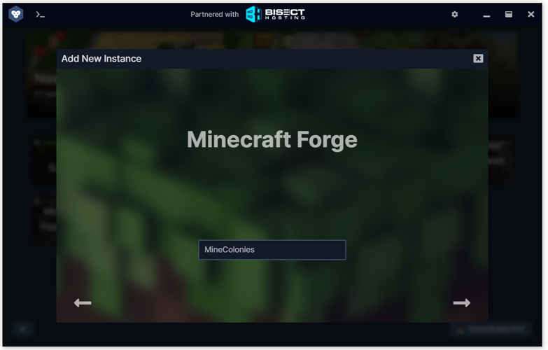
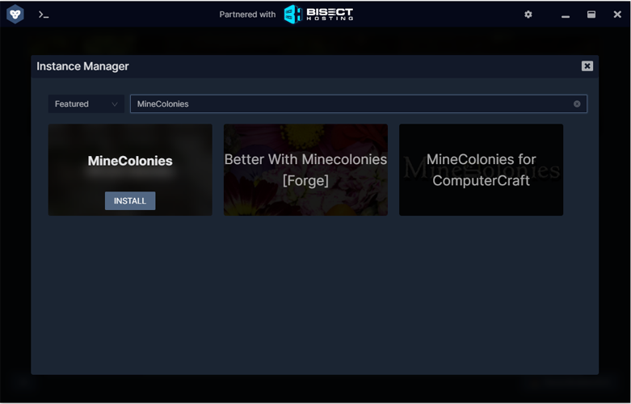
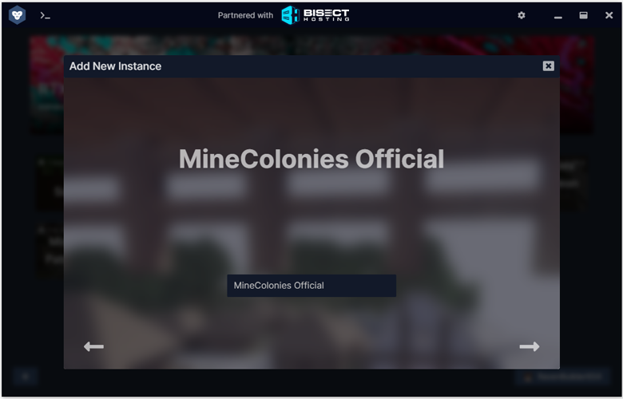

# GDLauncher Installation

Installing MineColonies via GDLauncher, a custom Minecraft launcher, is the recommended method.

- [GDLauncher Installation](#gdlauncher-installation)
    - [Getting GDLauncher](#getting-gdlauncher)
    - [Setting Up GDLauncher](#setting-up-gdlauncher)
        - [Account](#account)
        - [Create an Instance](#create-an-instance)
    - [Installing MineColonies Mod Only](#installing-minecolonies-mod-only)
    - [Installing MineColonies Official Modpacks](#installing-minecolonies-official-modpacks)
        - [Getting the Modpack](#getting-the-modpack)
        - [Installing the Modpack](#installing-the-modpack)
    
## Getting GDLauncher

GDLauncher can be downloaded [here](https://gdevs.io/#downloadContainer). Simply choose the version for your operating system and run the file.

## Setting Up GDLauncher

Once you've installed GDLauncher, setting it up is simple.

### Account

When you first open GDLauncher, it'll ask you to log in to your Minecraft account. Enter your account information and click Sign In.

### Create an Instance

Once you're logged in, you'll be able to create an "instance." Instances are GDLauncher's way of separating each version of Minecraft and each different set of mods you wish to install.

To create an instance, click the + button in the bottom left.

The steps past this point differ, depending on whether you're installing the mod or the modpack.

## Installing MineColonies Mod Only

Change the dropdowns to select the latest Forge version for the latest version of Minecraft. (At the time of this writing, the latest Minecraft version is 1.16.5.)

Next, click the white arrow in the bottom right. It'll prompt you to enter a name for your instance; enter whatever you'd like.

Once you're done choosing a name, click the bottom-right arrow again. Wait for GDLauncher to finish installing Forge. Once it's done, you should see the instance in the main menu (along with any other instances). Right-click it and click Manage.

Once you're in the Manage Instance menu, go to the Mods tab and click the Add Mod button at the top.

Search for "MineColonies" at the top, then click Install. (You can click elsewhere on the mod's icon to read the description.) GDLauncher will automatically install Structurize, a dependency of MineColonies.

You're ready to play! To launch Minecraft, close out of the instance manager and left-click on the instance icon (in the main menu).

## Installing MineColonies Official Modpack

When creating an instance, change from Vanilla to Twitch at the top. Search for "MineColonies Official".

Hover over the top result and click Download Latest (or Explore / Versions to read the description). It'll prompt you to choose a name for your instance.

When you're done, click the white arrow in the bottom left. GDLauncher will start installing the modpack.

Once GDLauncher is finished, **you're done!** Just click on the instance icon to launch Minecraft. Have fun!
