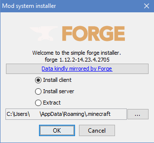
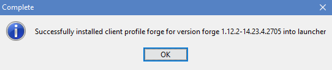
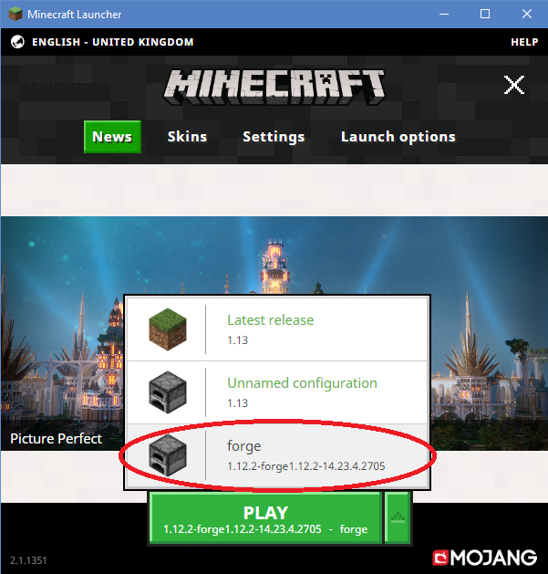

# Minecraft Java Edition

- [Minecraft Java Edition](#minecraft-java-edition)
    - [Installing MineColonies Mod on your original Minecraft Launcher.](#installing-minecolonies-mod-on-your-original-minecraft-launcher)
        - [Download Forge](#download-forge)
        - [Run Forge Installer](#run-forge-installer)
        - [Download MineColonies](#download-minecolonies)
        - [Navigate to Mods Folder](#navigate-to-mods-folder)
        - [Copy MineColonies to Mods](#copy-minecolonies-to-mods)
            - [If Adding Pack, Extract it](#if-adding-pack-extract-it)
        - [Run Minecraft and Select Profile](#run-minecraft-and-select-profile)

## Installing MineColonies Mod on your original Minecraft Launcher.

- This process is for installing only the MineColonies mod in your original Minecraft launcher. You will *not* be able to connect to the **MineColonies Official Servers** due to the servers having a balanced variety of other mods as well.

- For connecting to the Official Test Server, install [MultiMC](../installation/multimc) or use GDLauncher (no installation tutorial at this time). You can visit the [CurseForge](https://minecraft.curseforge.com/projects/minecolonies-testpack) site for a zip file containing all mods and the versions we are currently using on the Official Test Server, as well as all the appropriate configs, scripts and the server.dat file for our modpack Official Test Server. If all these additional mods, configs, scripts and the server.dat are downloaded and installed manually, you will be able to connect to our Official Test Server. 

- Installation of the MineColonies mod is very simple. It does require Minecraft Forge to be able to integrate mods into the Minecraft game, though.

*We cannot offer support on the installation of Minecraft Forge, however, there are many excellent (and more in-depth) tutorials online. Just Google 'how to install minecraft forge' to find some.*

---

### Download Forge

Go to the [Minecraft Forge Download page](http://files.minecraftforge.net/?forums) and download the latest version.

### Run Forge Installer

Run the downloaded recommended version and make sure it's on Install Client (or Server if you plan to run a Minecraft Server). The installation path is preset according to Minecraft's standard installation path. If you have it installed in a different directory, change the installation directory. When it's done installting, you will see a complete message.

    

### Download MineColonies

Go to the [MineColonies CurseForge Download page](https://curseforge.com/minecraft/mc-mods/minecolonies/files/all) site and download the latest 1.15.2 alpha version of MineColonies.

### Navigate to Mods Folder

On your computer, go to the **.minecraft/mods** folder. To be able to find this folder, just click on the start button and in the search box type: *%appdata%* and hit "search". It will open the folder where you can find the **.minecraft** folder. Open this folder and inside you will find the **mods** folder.

### Copy MineColonies to Mods

Once you are in the **.minecraft/mods** folder, copy the downloaded MineColonies file you downloaded in Step 1 and paste it here. NOTE: DO NOT extract the file if the option appears. Just put the .jar file in here without extracting its contents.

### Do the Same Thing for Structurize

Follow the last three steps, except for Structurize (which MineColonies needs to work). Find the download page for Structurize [here](https://www.curseforge.com/minecraft/mc-mods/structurize/files/all).

#### If Adding Pack, Extract It

If you are adding the entire modpack to be able to play on the official server, then un-zip the zip file you got from CurseForge containing all the mod files here.

### Run Minecraft and Select Profile

Run your original Minecraft launcher. Make sure you have the **forge** profile loaded and hit play.

That's it. If you followed these steps, you are ready to play MineColonies!
