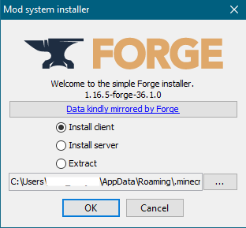
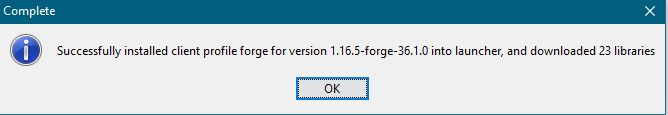

# Minecraft Java Edition

## Installing Miecolonies Mod on your original Minecraft Launcher. No Twitch Client, no other mods.

* This process is for installing only the Minecolonies mod in your original Minecraft launcher. You will _not_ be able to connect to the **Minecolonies Official 1.12.2 Server** due to the server having a balanced variety of other mods as well.

* For connecting to the Official Server, install the Twitch Client or visit the [CurseForge](https://minecraft.curseforge.com/projects/minecolonies-testpack) site for a zip file containing all mods used on Server. If all these additional mods are downloaded and installed as well, you will be able to connect to the official Server. 

### The Official Minecolonies Server Address is:

* Installation of the MineColonies mod is very simple. It does require Minecraft Forge to be able to integrate mods into the Minecraft game.

_We cannot offer support on the installation of Minecraft Forge. This guide is meant as a general guide for the original Minecraft launcher only for current version 1.12.2 (as of the writing of this post)._

### Step 1

* Go to the [Minecraft Forge Download page](http://files.minecraftforge.net/?forums) and Download the "Recommended" Version.

### Step 2

* Run the downloaded recommended version and make sure it's on "Install Client". Installation path is preset according to Minecraft's standard installation path. If you have it installed in a different directory change the installation directory. When it's done you will see a "Complete" message.

|  |  | 
|---|---|

### Step 3

* Go to the [MineColonies CurseForge Download page](https://minecraft.curseforge.com/projects/minecolonies/files) site and download the latest 1.12.2 version of MineColonies.

### Step 4

* On your computer go to the **.minecraft/mods** folder. To be able to find this folder, just click on the start button and in the search box type: _%appdata%_ and hit "search". It will open the folder where you can find the **.minecraft** folder. Open this folder and inside you will find the **mods** folder.

### Step 5

* Once you are in the **.minecraft/mods** folder, copy the downloaded MineColonies file you downloaded in Step 1 and paste it here. NOTE: DO NOT extract the file if the option appears. Just put the .jar file in here without extracting it's contents.

#### Step 5A

* If you are adding the entire modpack to be able to play on the official server, then un-zip the zip file you got from CurseForge containing all the mod files here

### Step 6

* Run your Original Minecraft launcher and make sure you have the **forge** profile loaded and hit Play

That's it. If you followed these steps you are ready to play MineColonies!
