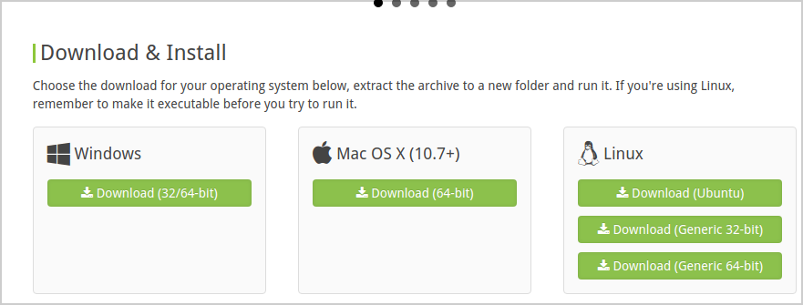
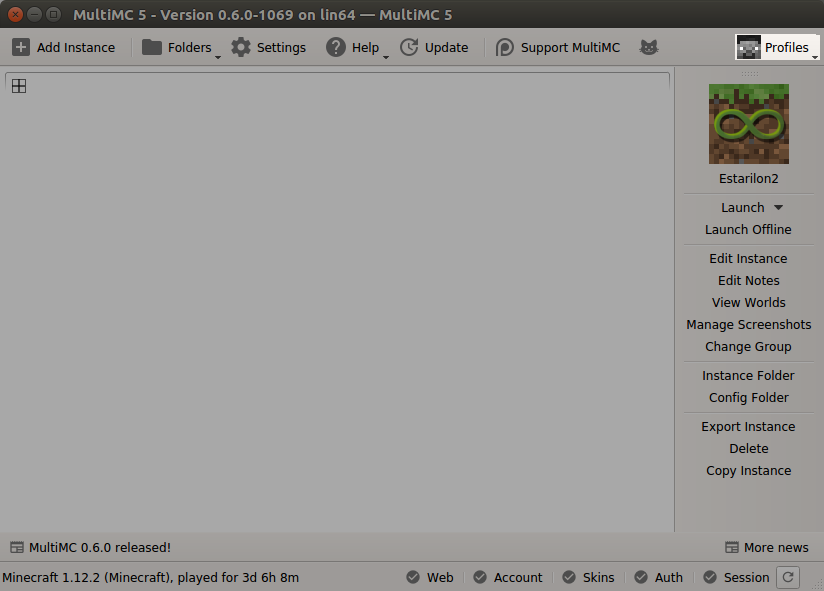
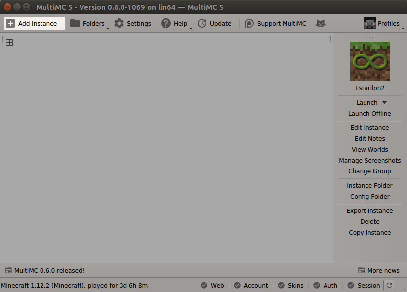
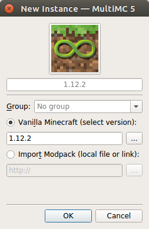
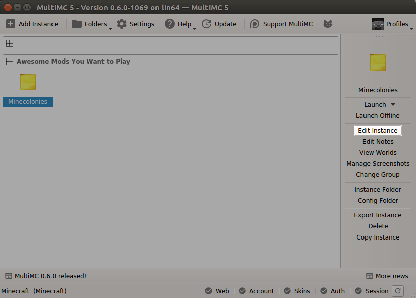
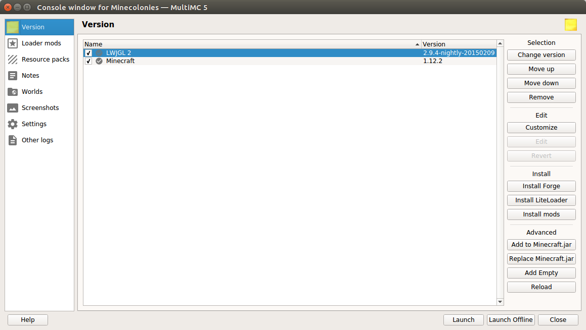
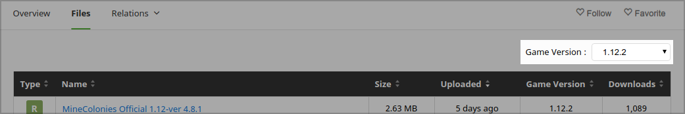
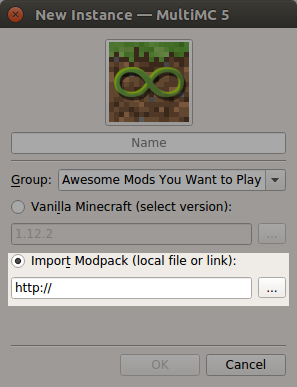
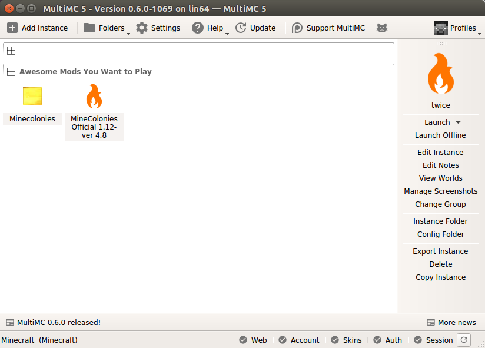

# MultiMC Installation

Installation via MultiMC is very easy, and works on Windows, Mac and Linux.

Below are the steps you will need to take in order to install the MineColonies Official Modpack to play on the MineColonies official server, or to play MineColonies for singleplayer.

**Note:** the MineColonies Official Server uses Minecraft 1.14.4.

- [MultiMC Installation](#multimc-installation)
    - [Getting MultiMC](#getting-multimc)
    - [Setting Up MultiMC](#setting-up-multimc)
        - [Account](#account)
        - [Create an Instance](#create-an-instance)
    - [Installing MineColonies Mod Only](#installing-minecolonies-mod-only)
    - [Installing MineColonies Official Modpacks](#installing-minecolonies-official-modpacks)
        - [Getting the Modpack](#getting-the-modpack)
        - [Installing the Modpack](#installing-the-modpack)
{: .box .py-3 .pr-4 }

## Getting MultiMC

MultiMC can be downloaded here: [MultiMC download page](https://multimc.org/#Download). Simply choose the version for your operating system and install.

This guide currently assumes that you have the latest version of MultiMC (v. 0.6.7), and will probably not work for older versions. If you already have an older version installed, please update it!

It will also assume that you're using Minecraft 1.15.2, but will work for any version.

- **Important Note:** Please ***do not*** download and install a copy of MultiMC from any other source besides [MultiMC.org](https://multimc.org) or their official [GitHub page](https://github.com/MultiMC/MultiMC5/)! MultiMC is free and open source, so copies obtained elsewhere may come bundled with malware, or may come bundled with extra code that can hijack your Mojang account!

## Setting Up MultiMC

Setting up MultiMC is pretty quick, depending on your download speed. You **do not need an existing Minecraft install**, but you will need to log in with your Mojang account.

### Account

Click the highlighted button, select "Manage Accounts", and on the window that appears, fill in your Mojang account details.

### Create an Instance

Once your account details are squared away, you'll be able to create an "instance." Instances are MultiMC's way of separating each version of Minecraft and each different set of mods you wish to install.

Click the highlighted button, which will bring up this window:

The button that is important to us here is the one beside the "1.15.2", in the above image. If you wish to use a version of Minecraft that **isn't** 1.15.2, this is where you select it.

You can also fill out the other areas, selecting an icon, naming the instance, and giving it a group:

When you're done filling things in, click ok. You'll have something like this:

## Installing MineColonies Mod Only

Next, we'll walk you through setting up your instance to play MineColonies (or any other mod that uses Forge, the steps are the same).

Before we get started, download MineColonies from [this](https://www.curseforge.com/minecraft/mc-mods/minecolonies/files/all) page, selecting the latest 1.15.2 alpha version.

Then, switch back over to MultiMC and click "Edit Instance". The button we are looking for is located here:

Clicking it brings up this screen:

On the right side, click the button labeled "Forge". Select the appropriate version (for most mods, the version recommended by the Forge team, which is highlighted with a star on the list), and click ok. This downloads and installs Forge for you - no fiddling around with jar files and installers. Next!

On the left side, select "Loader mods". This switches the window to one that allows you to install mods to the instance you're in.

On the left is a button that says Add. Click it and navigate to the location you downloaded MineColonies to, then click "Open". You'll have something that looks like this:

Next, repeat the above steps, except for Structurize (which MineColonies needs to work). You can download Structurize [here](https://www.curseforge.com/minecraft/mc-mods/structurize/files/all).

That's it! You're done! MineColonies and Structurize are now installed! Hooray!

To play it, all you need to do is click "Launch", which can be done from either the "Edit Instance" screen, or the right-side menu on MultiMC's main window.

## Installing MineColonies Official Modpack

### Getting the Modpack 

Head over to [this page](https://minecraft.curseforge.com/projects/minecolonies-testpack/files) on CurseForge and download the zip file for the version of Minecraft you intend to play.

You can filter for your version in the dropdown located on the right side of the page:

### Installing the Modpack

If you followed along with the "Setting up MultiMC" section, you should remember creating an instance. Installing a modpack is almost *exactly* the same, which one change in the steps: on the "Add Instance" screen, what we want is this:

On this screen, click the circle, then click the [...] button off to the side (the highlighted area above), then click "Ok". A window will appear saying things like "Resolving mod ids...", and "Downloading mods..."-depending on your internet connection, this could take a few minutes.

And... you're done!

