# Twitch Installation

If you want to play on the **MineColonies Official 1.14.4** Server, we highly recommend using Twitch to always be up to date with all the mods we use in our official server.

- [Twitch Client](#twitch-client)
    - [Installation of the Modpack through the Twitch Client](#installation-of-the-modpack-through-the-twitch-client)
        - [Navigate to Mods](#navigate-to-mods)
        - [Enable Minecraft](#enable-minecraft)
        - [Install Minecraft](#install-minecraft)
        - [Browse Modpacks](#browse-modpacks)
        - [Search for MineColonies Pack](#search-for-minecolonies-pack)
        - [Launch Profile](#launch-profile)
        - [Login](#login)
        - [Click Play in Minecraft Launcher](#click-play-in-minecraft-launcher)
            - [Open Profiles List](#open-profiles-list)
            - [Select MineColonies](#select-minecolonies)
        - [Select Multiplayer](#select-multiplayer)
        - [Select our Server](#select-our-server)
{: .box .py-3 .pr-4 }

- Click on the text below the Twitch logo to download the Twitch client. On that page, select download for PC or MAC and begin your download.

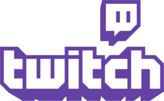

[Download the Twitch client here!](https://app.twitch.tv/ "Twitch App")

- Once you have downloaded the Twitch client, run the installation and login to the Twitch client.

*Sign up to Twitch if you haven't yet, or convert your old Curse account to a Twitch account.*

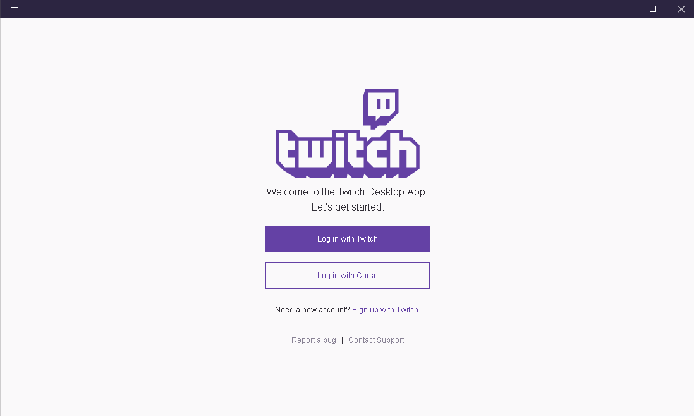

## Installation of the Modpack through the Twitch Client

### Navigate to Mods

On the top bar of the Launcher, look for the tab called Mods. Click on it and then select Minecraft.

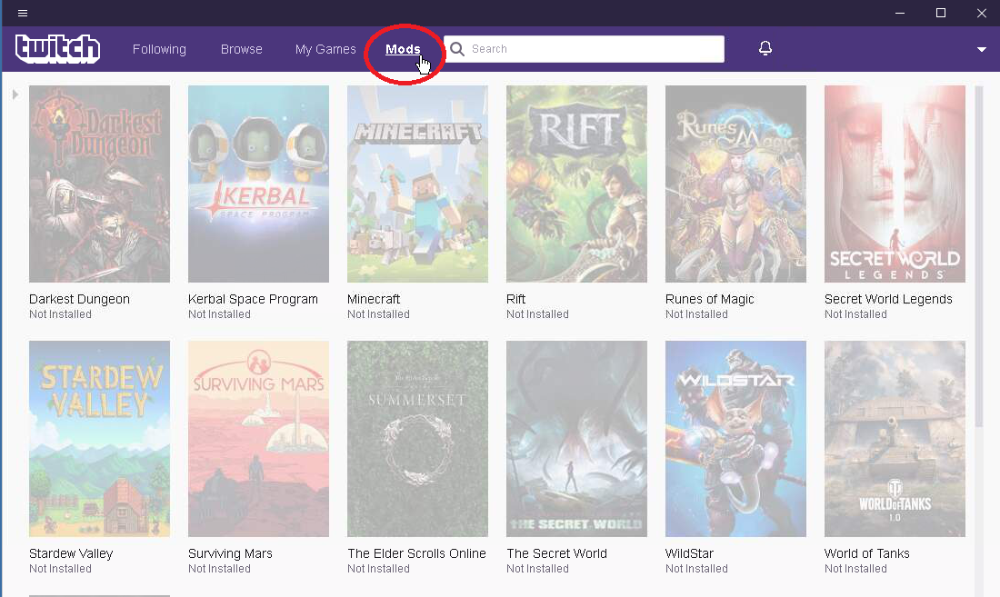

### Enable Minecraft

The Twitch client will prompt you to "Enable Minecraft", which will restart the launcher.

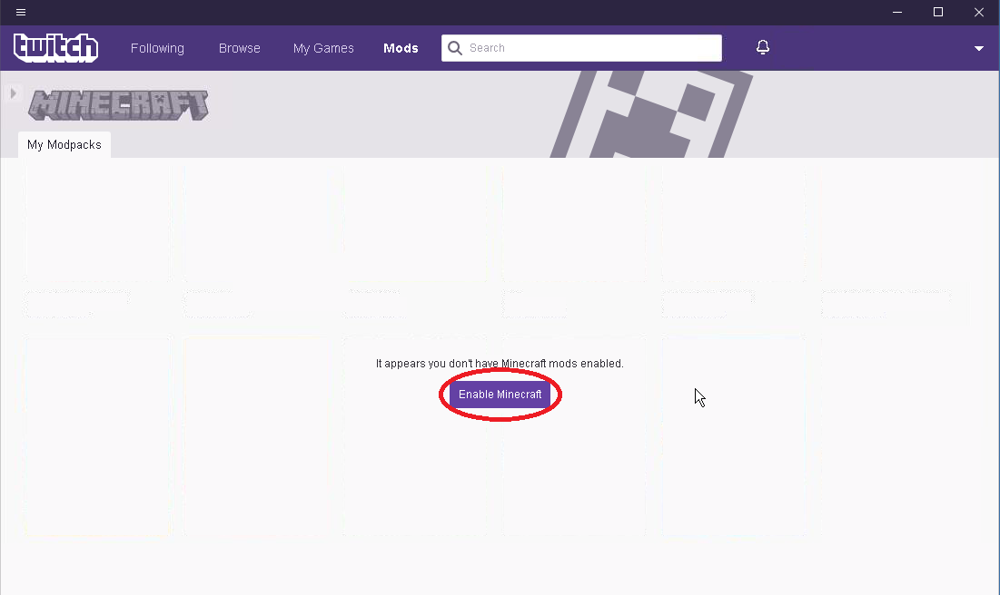

### Install Minecraft

Click on the Install button. Use the Advanced option if you want to select another location for the installation folder. The default folder is C:/Users/(your user)/Documents/Curse/Minecraft.

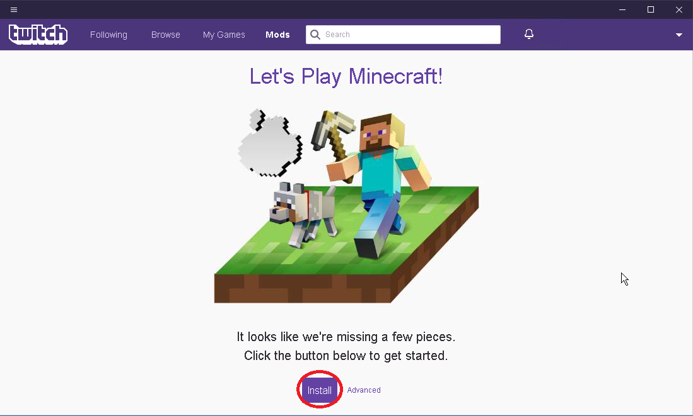

### Browse Modpacks

After the installation is done, select Browse all Modpacks.

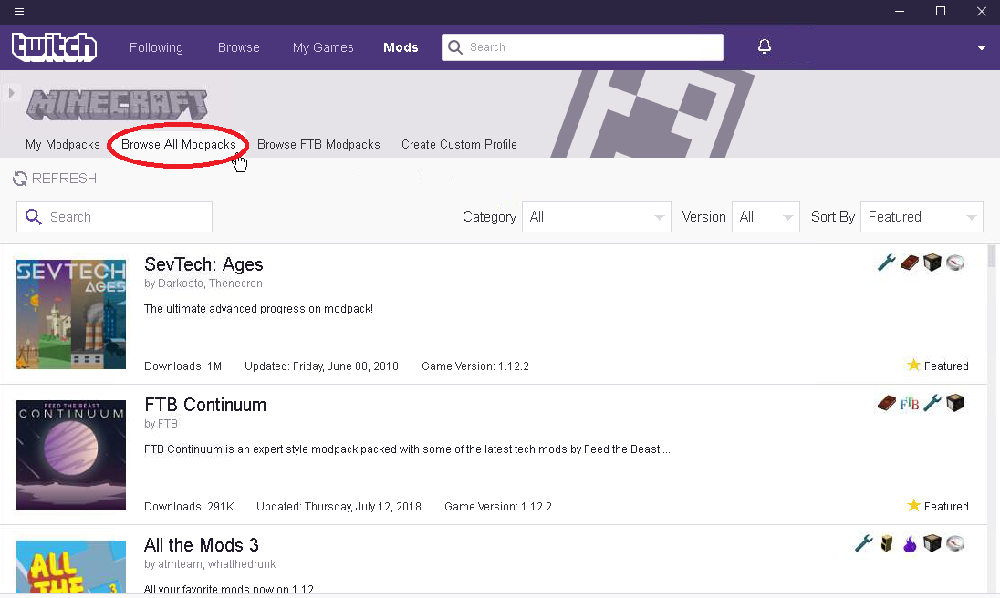

### Search for MineColonies Pack

Type in the search bar "MineColonies." Once you see "MineColonies Official" (_by Kostronor, H3lay, 1_Wissi_1. Asherslab81358, D3miurge_), click on "Install".

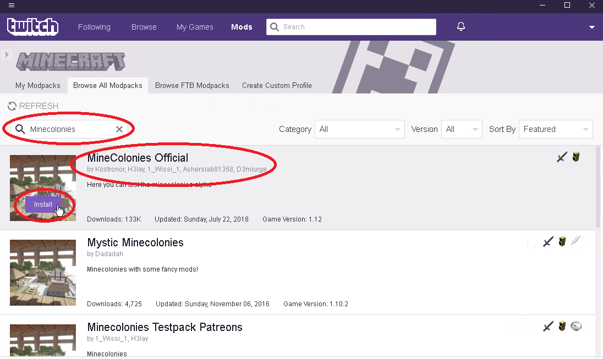

### Launch Profile

Once the installation is finished downloading all the mods, click on PLAY.

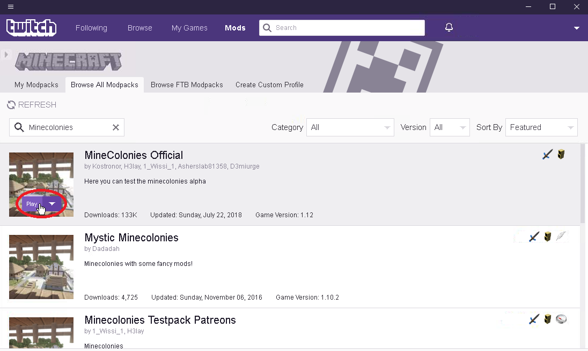

### Login

Login to your Minecraft account.

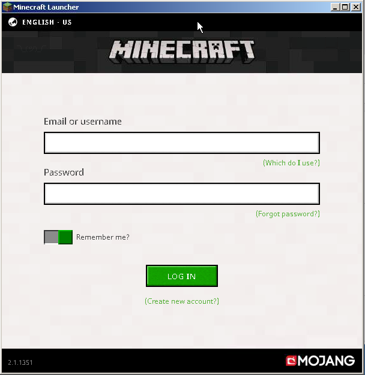

### Click Play in Minecraft Launcher

Click the green play button if it's already set to "MineColonies Official". If not, then a couple substeps are needed.

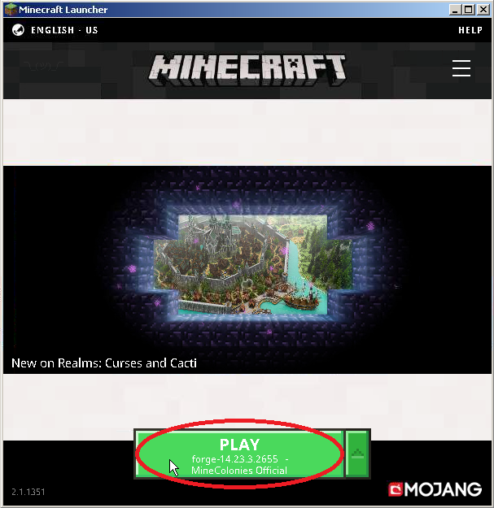

#### Open Profiles List

Click the green arrow (pointing up) to select your profile.

#### Select MineColonies

Click the "MineColonies Official" profile. Then you're ready to click Play!

### Select Multiplayer

When Minecraft has loaded up, click on the Multiplayer button.

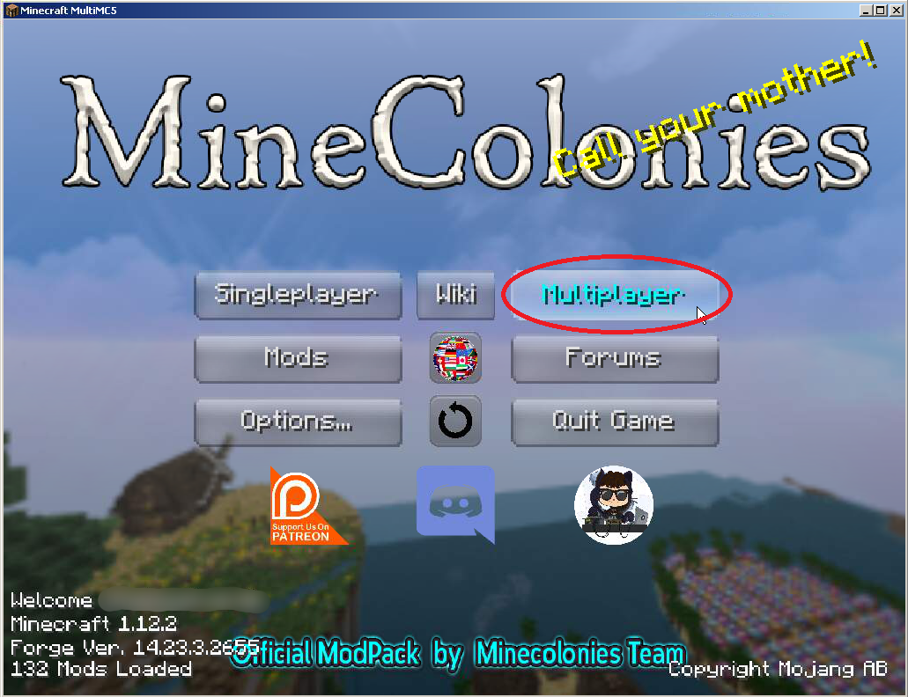

### Select our Server

Finally, click on MineColonies Official 1.14.4! The server info will be set up already.

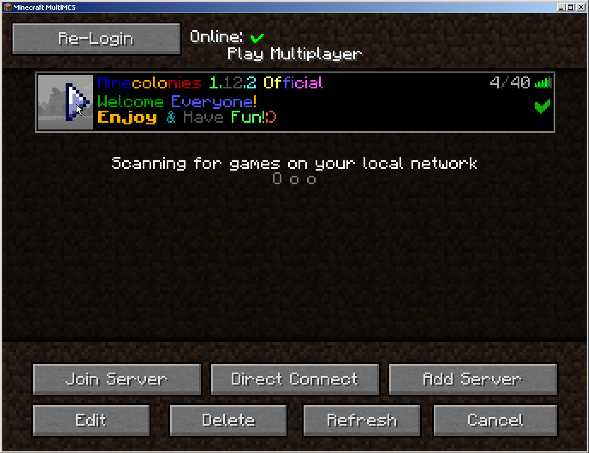

That's it! Good luck, have fun. See you in the server.
