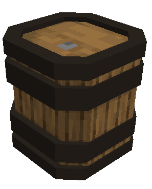

# Vertical Barrel

    

    <recipe>barrel_vertical</recipe>

 

The vertical barrel is a decoration. 
 

## Using the Vertical Barrel

Vertical barrels are decorations and have no purpose. They are used in the Tavern schematics.
