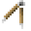

# Calipers

    

    <recipe>The calipers cannot be crafted.</recipe>

 

The calipers are for measuring the size of lines, squares, and rectangular prisms. They cannot be crafted and are only available in creative mode.
 

## Using the Calipers

To use the calipers to measure a line, right-click on the last block on each end of the line. (Note: as of right now the white lines will not be displayed.)  

 

To use the calipers to measure a square, right-click on the front corner on one side and the back corner on the opposite side. You will get the length and width of the box, as well as the diagonal length. (Note: as of right now the white lines will not be displayed.)  

 

To use the calipers to measure a rectangular prism, right-click on the front bottom corner on one side and the back top corner on the opposite side. You will get the length, width, and height of the rectangular prism, as well as the diagonal length. (Note: as of right now the white lines will not be displayed.)  

 

