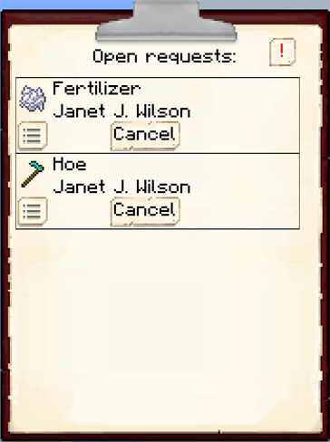
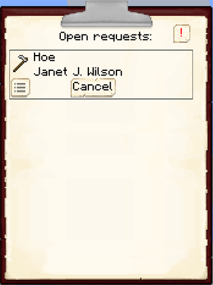

# Clipboard

    

    <recipe>clipboard</recipe>

The clipboard is an easy way to see all the requests your workers have (that are not being fulfilled by a [Courier](../../source/workers/courier)).

## Using the Clipboard

When you first make the clipboard and right-click anywhere, you will get a message to sneak + right-click on the [Town Hall](../../source/buildings/townhall) to register the clipboard.

 

 

After you register the clipboard, this message will appear:
 

 

Now when you right-click while holding the clipboard, you will see all your citizens' requests on the clipboard (that are not being fulfilled by a [Courier](../../source/workers/courier)) and as long as you are close to your colony!

 

 

If you click on the exclamation mark in the top right, you will only see requests for things that workers need *right now.*

 

 
