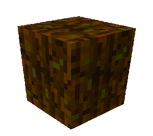

# Compost 

    

    <recipe>compostblock</recipe>

 

There are two types of compost. There is composted dirt which is used in the [Flower Shop](../../source/buildings/flowershop) schematics, and there is the compost item which is used by the [Florist](../../source/workers/florist) and the [Farmer](../../source/workers/farmer) like bonemeal.
 

## Using Compost

The [Composter](../../source/workers/composter) uses a [compost barrel](../../source/items/compostbarrel) to create compost (the item). It works like bonemeal to increase the speed of plant growth. The Florist must have compost to grow flowers. The Farmer does not need compost or bonemeal to work, but prefers it (this is toggleable in the [Farm](../../source/buildings/farm&field) GUI).

Composted dirt is crafted by the Farmer. It is used in the Flower Shop schematics.
