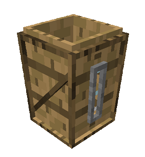

# Compost Barrel 

    

    <recipe>barrel</recipe>

 

The compost barrel is used by the [Composter](../../source/workers/composter) to make [compost](../../source/items/compost).
 

## Using the Compost Barrel

The compost barrel is primarily used by the Composter to make compost, but it can also be used by the player to do the same thing (right-click while holding a compostable item to raise the level of compost in the compost barrel). It can also be used as decoration.
