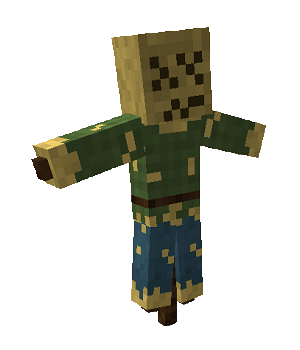
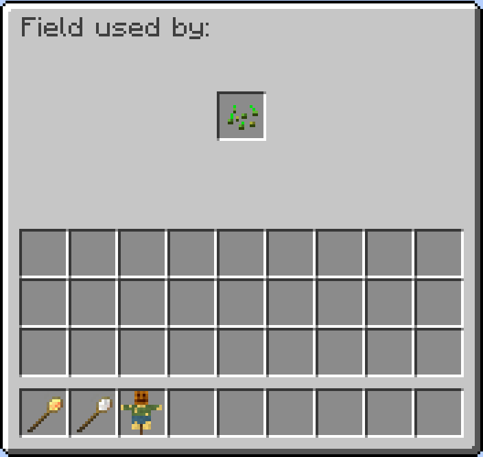

title: Minecolonies Wiki
layout: default
---
# Field 

## Welcome to the Field page. 

 

    

 

    <recipe>field</recipe>

 

### The Item

The Field is a scarecrow block that is used to denote where the farmer will farm. 
 

### Using the Field

The Field is used by the Farmer to mark the center of a plot of land to farm. If there are no boundaries the farmer will hoe, five blocks out from the Field block. However, if water isn't available, the farmland will revert to dirt. 
 

