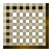
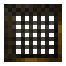

# Meshes

    

    

    

    

    Meshes can only be crafted by certain MineColonies crafters.

 

MineColonies adds four meshes used by the [Sifter](../../source/workers/sifter) to sift through items. The Sifter will automatically unlock these recipes for your colony once the requirements are met. String Meshes are the most fragile, followed by Flint Meshes, while Iron is more durable, and Diamond the most resilient. Better meshes can also sift out materials earlier meshes would have missed.

| Mesh    | Requires             | Crafter | Cost |
| ------- | -------------------- | ------- | ---- |
| String  | [Sifter's Hut](../../source/buildings/sifter) at least level 1 | [Fletcher](../../source/workers/fletcher) | 1 String |
| Flint   | Sifter's Hut at least level 3 | [Stonemason](../../source/workers/stonemason) | 1 Flint |
| Iron    | Sifter's Hut at least level 4 | [Blacksmith](../../source/workers/blacksmith) | 1 Iron Ingot |
| Diamond | Sifter's Hut at least level 5 | [Mechanic](../../source/workers/mechanic)   | 1 Diamond |