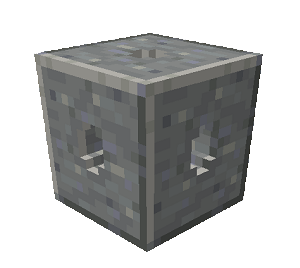
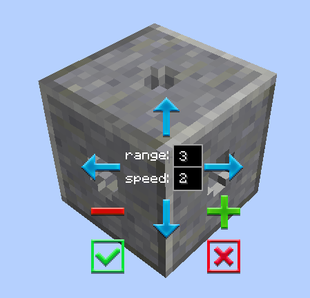
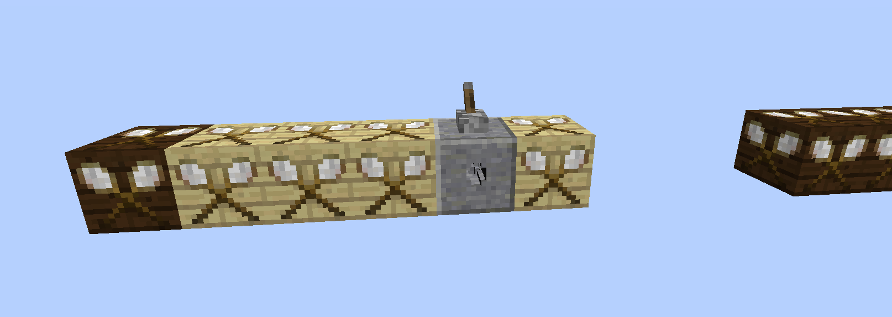

# Multiblock

    

    <recipe>multiblock</recipe>

 

### The Block

The multiblock looks like a smooth andesite block with a hole in each face. It lets you move multiple blocks at a time.

 

### The GUI

Place the multiblock beside, above, or below the blocks you want to move, then right click it to open the GUI. 

 

 

You will see 4 blue arrows, a + and a - with Range: and Speed: in the center. The arrows refer to the cardinal directions, up for North, down for South, right for East and left for West. The + is to raise and the - is to lower.  The range is 10 blocks and the speed: is 1-3, 3 being the fastest. 

You will need to left-click on one of the arrows, +, or - and it will turn green. This shows the directions the blocks will move when the multiblock is activated by redstone. Then right-click on another arrow, +, or - for the direction the blocks will move when the redstone signal is off. (This is typically the location of where the blocks are currently in the build.)

**Note:** All blocks being moved must be the same in order to work.

**Note:** There must be enough room for all the blocks to move or it will stop.

 
