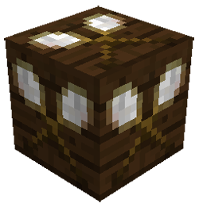

# Placeholder Blocks

    

    
    

    <recipe>placeholderblock</recipe> <recipe>solidplaceholderblock</recipe> <recipe>fluidplaceholderblock</recipe>

The placeholder blocks (also called substitution blocks) are tan, brown, and blue. The tan block is the placeholder block, the brown is the solid placeholder block, and the blue is the fluid placeholder block. Each serves its own function. 

All kinds of placeholder blocks can be crafted at the [Sawmill](../../source/buildings/sawmill).

## Using the Placeholder Blocks

- The placeholder block tells the mod to leave any blocks that are currently in that spot alone. It will not remove or change anything that already exists in that spot.
- The solid placeholder block tells the mod to replace any non-solid blocks (air, grass, leaves, etc.) with the biome's regular ground block (grass, sandstone, red sandstone, white terracotta, etc).
- The fluid placeholder block tells the mod to replace any non-solid blocks with the biome's preferred fluid (water in the overworld, lava in the Nether). Already-existing solid blocks or fluids will be left alone.

You can make and use these blocks in survival, but they are mainly used to scan schematics.

Here's an example:
 

 
