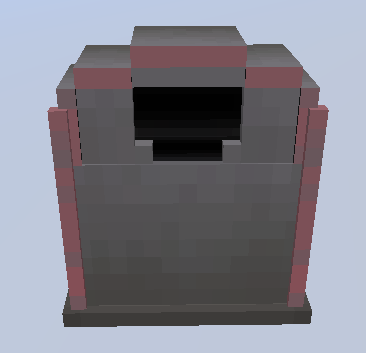
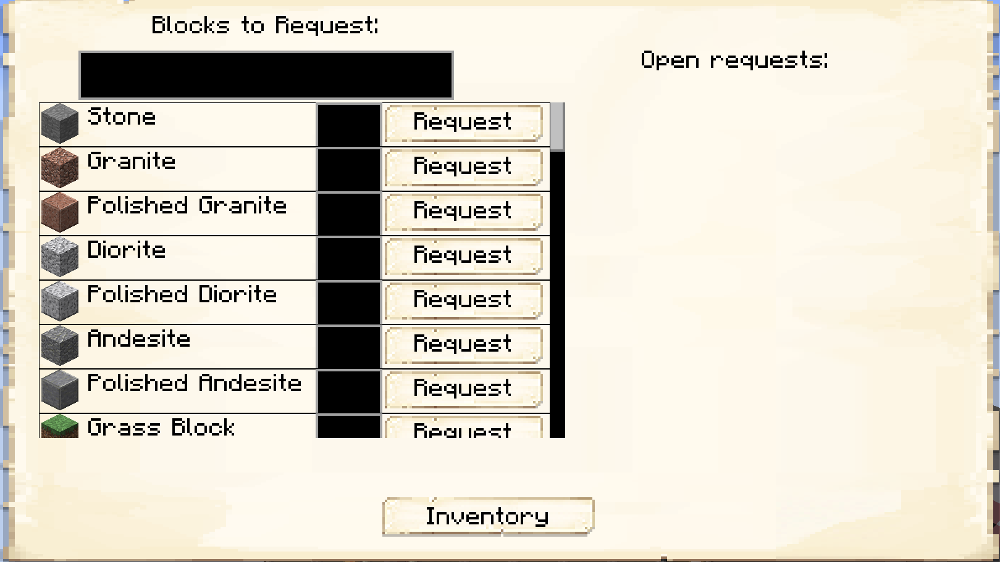

# Postbox 

## Welcome to the Postbox page. 

    

    <recipe>postbox</recipe>

 

### The Item

The postbox is for the player to request items from the [Warehouse](../../source/buildings/warehouse). A [Deliveryman](../../source/workers/deliveryman) will deliver them to the postbox. 

 

### Using the Postbox

To use the postbox, right click on it to bring up the GUI.

You can search for the item you want in the top box. When you find the item, enter in the field beside it how many you want, then press request. The requested items will show on the right side of the screen. Once a Deliveryman fulfills the request, the items will be in the postbox's inventory.
