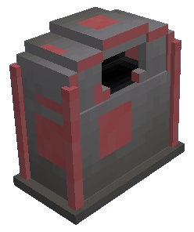

# Postbox

    <recipe>postbox</recipe>

 
Welcome to the Postbox page. 
  

 

 

### The Block
 
Crafting the postbox requires 5 planks (any wood), 3 chests, and the build tool. 
 

### The GUI

In the postbox gui, you can request items to be delivered from the warehouse by the deliverymen. 

 

 

When you enter in the amount you need, and press request, the requests will be displayed on the right side.

 

 

