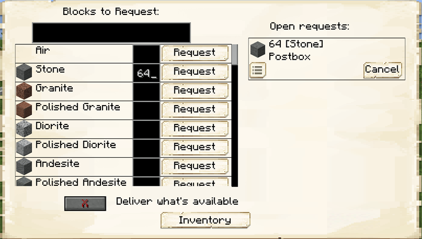

# Postbox 

    

    <recipe>postbox</recipe>

 

The postbox is for the player to request items from the [Warehouse](../../source/buildings/warehouse). A [Courier](../../source/workers/courier) will deliver them to the postbox.

The postbox can be crafted at the [Sawmill](../../source/buildings/sawmill) or by the player.

 

## Using the Postbox

To use the postbox, right-click on it to bring up the GUI.

You can search for the item you want in the top box. When you find the item, enter in the field beside it how many you want, then press request. The requested items will show on the right side of the screen. Once a Deliveryman fulfills the request, the items will be in the postbox's inventory.

There is also an option to 'Deliver what's available.' If, for example, you have this on and you request 64 stone, but your [Warehouse](../../source/buildings/warehouse) only has 33 (and you don't have a [Stone Smelter](../../source/workers/stonesmelter) to smelt more), a [Courier](../../source/workers/courier) will bring you the 33 stone instead of none. (This option will not stay on if you exit the postbox GUI, but any requests made with it turned on will stay the same.)
