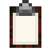
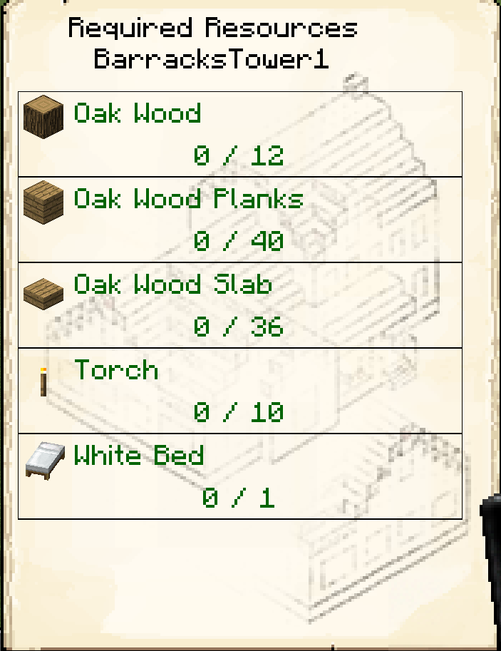

# Resource Scroll 

    

    <recipe>resourcescroll</recipe>

## The Item

The resource scroll is an easy way to tell what one of your Builders needs. It's like the portable second page of the Builder's Hut!

## The Use

When you first make the resource scroll, if you right-click anywhere you will get a message to shift + right click on a Builder's Hut to register the resource scroll. 

 

 

Now when you right-click while holding the resource scroll, you will see all the needed materials for the Builder's Hut you clicked on!

 

 
