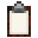

# Resource Scroll 

 
Welcome to the Resource Scroll page. 
  

 

    

    <recipe>resourcescroll</recipe>

### The Item

The Resource Scroll  is easy to craft, simply 2 leather, the build tool, and sticks.  
 

### The Use

When you first make the Resource Scroll , and right click anywhere you will get a message to shift + right click on the townhall to register the Resource Scroll. 

 

 

Now, you will go to the TownHall block and Shift + Right Click on it and the registered message will appear.

 

 

Now, if you right click anywhere you will get a message to shift + right click on a builder hut to register the Resource Scroll. 

 

 

Now, when you right click any where, any time, you will see all the requests on the scroll for the builder you clicked on. 

 

 
