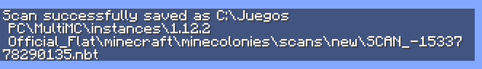
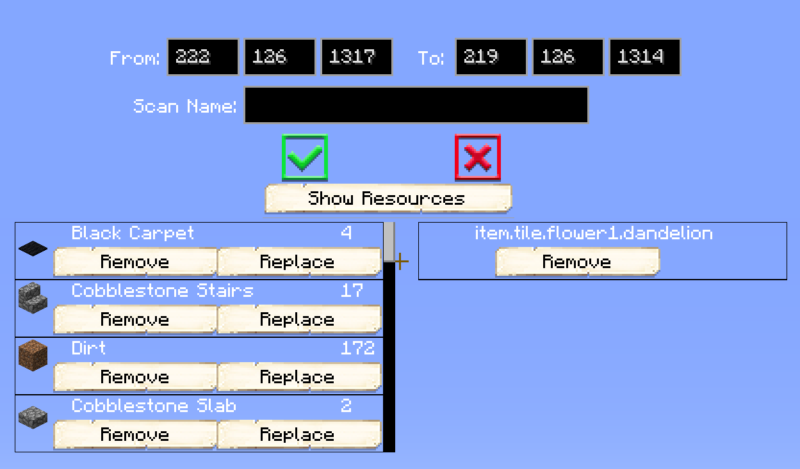

# Scan Tool

## Welcome to the Scan Tool page.

    

    <recipe>scantool</recipe>

 

The scan tool is a very useful tool. With the scan tool, you can scan any structure you like and have your Builder build it for you! So if you build a  house, wall, bridge, tower, shop or any other structure that you want in your colony, you can scan it. You can scan a structure in Singleplayer or Multiplayer (even on a server). The scanned structure will be in a [schematic](../tutorials/schematics) file that you can then use the build tool to place and have your Builder build it for you. Want your Builder to clear an area for you (and level up while working)? Then scan an area of air and place it with the building tool over what you want the Builder to clear! They'll clear that area away leaving only air! Watch a short video of how it works here:

Scan Tool Video

  <iframe class="embed-responsive-item" src="https://www.youtube.com/embed/mFIC3752o1c" allow="autoplay; encrypted-media" allowfullscreen></iframe>

 

**Hint:** There are two blocks in Minecolonies that are made specifically for helping players make schematics.
1. [Placeholder Block](../../source/items/substitutionblocks): This block will not be scanned and will use the block that is already there, like air, grass, cobblestone, etc.
2. [Solid Placeholder Block](../../source/items/substitutionblocks): This block will guarantee the block placed will be solid according to the biome it's being built on. 

### Step One

The first step is to craft a scan tool.
 

### Step Two

Then left-click the lower front corner (left or right makes no difference) at ground level of the structure.

### Step Three

Right-click on the top opposite corner of the structure (you can use a Placeholder Block for this), leaving the entire structure inside this imaginary box.

### Step Four

At this point you will have two options: 

**1. You can shift + right-click to directly save the schematic.**

**2. You can right-click in the air again to get the scan tool GUI.**

Here you will be able to see the coordinates for the scan you just did and will be able to give your scan a name.  
Use the green arrow if you are ready to save your scan or the red X to cancel the GUI and start over.  
You can click on the Show Resources button to see all the blocks that are in the scan you just did.

Finally, you can scroll through all the blocks that are in the scan and you even have two options there:

* Remove, to remove any of the blocks you see in your scan that you don't want in there.
* Replace, to replace that block with any other block you prefer for that scan.
