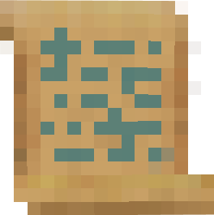
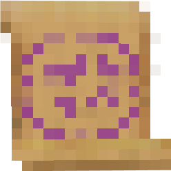
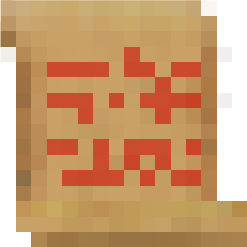

# Scrolls

    

    

    

    

    

    Scrolls as magical as these can only be crafted by someone well-versed in the art of spellcasting.

 

MineColonies adds 5 magical scrolls:

- Ultrasafe colony teleport scroll
- Ultrasafe colony group-teleport scroll
- Sacred Scroll of Regeneration
- Spatial guard reinforcement scroll
- Worker-where-are-you scroll

To use a scroll, hold down right-click with the scroll in your main hand. Scrolls have a small chance to fail. Whether it fails or not, the scroll will disappear after using it.

### Ultrasafe colony teleport scroll

This scroll will teleport you to your [Town Hall](../../source/buildings/townhall) when used. You must register it to your Town Hall first by shift + right-clicking on the Town Hall hut block.

It is crafted by the [Enchanter](../../source/workers/enchanter) with 3 paper, 1 compass, and 1 [build tool](../../source/items/buildtool).

### Ultrasafe colony group-teleport scroll

### Sacred Scroll of Regeneration

### Spatial guard reinforcement scroll

### Worker-where-are-you scroll

