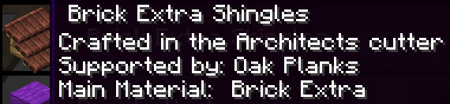
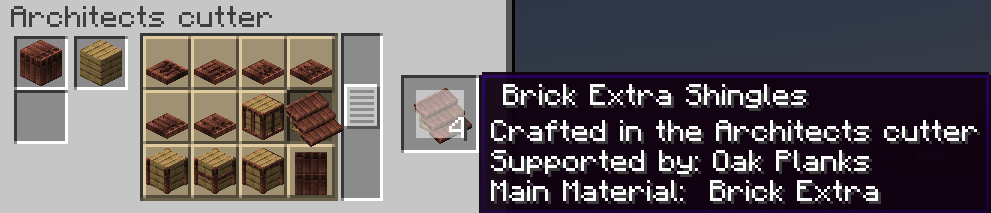
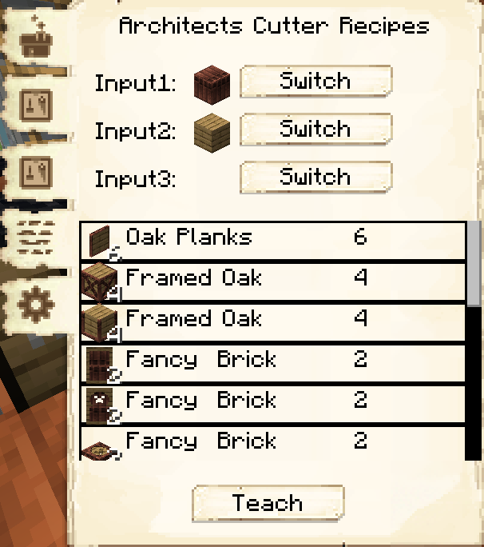

# Shingles
 

[For Shingles in 1.17 and higher versions that use Domum Ornamentum click here](#domum-ornamentum-shingles)

 

    <recipe>shingleclay</recipe>
    <recipe>shinglemoss</recipe> 
    <recipe>shingleslate</recipe>
    <recipe>shinglethatched</recipe> 
    <recipe>shingleslab</recipe>
    <recipe>shingleslabslate</recipe> 
    <recipe>shingleslabthatched</recipe>
    <recipe>shingleclaycolors</recipe> 
    <recipe>shingleslatecolors</recipe>
    <recipe>shingleslabcolors</recipe> 

 

Shingles are decorative roofing tiles for the tops of buildings. Shingles come in all wood types, including [cactus planks](../../source/items/cactusplanks), and many different colors. 

There is even a shingle half slab for the crown of the roof that comes in all the colors as well!

Shingles can be crafted at the [Sawmill](../../source/buildings/sawmill) and dyed at the [Dyer's Hut](../../source/buildings/dyer).
 

## Using Shingles

Use shingles like you would use stairs to create roofs for buildings.

  

## Domum Ornamentum Shingles
 

 Things changed in 1.17 with the addition of the Architect Cutter and Domum Ornamentum.

 The easiest way to find the materials you need is to hover your mouse over the the image of the item in a request for a shingle, this will bring up an information box, telling you the name of the shingle, that it is crafted in the architect cutter, the main material, and the support material.

When you have that information, you can put the materials in the architect cutter. Once you have the materials in place, click on the image of the shingle in the middle section of the cutter's GUI and it will show a shingle in the output box. Check carefully to make sure the output shingle matches EXACTLY the required materials from the request

When you have your sawmill up and running, you can then teach them the recipe as well, by choosing the "custom recipe" tab and putting it in there.
Input 1 is the top left slot of the cutter, input 2 is the top right, and input 3 the bottom left slot in the cutter. When you have put the items in the slots, you will see various items below the input slots, the sawmill can create ALL of those items from the recipe you have input.

